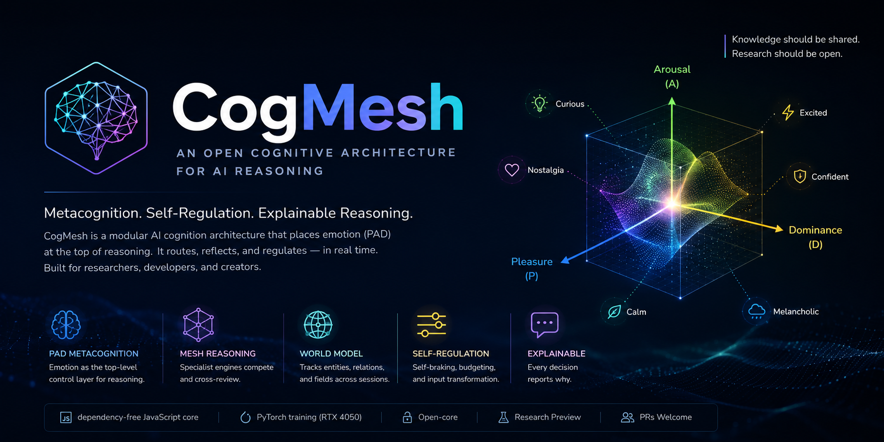
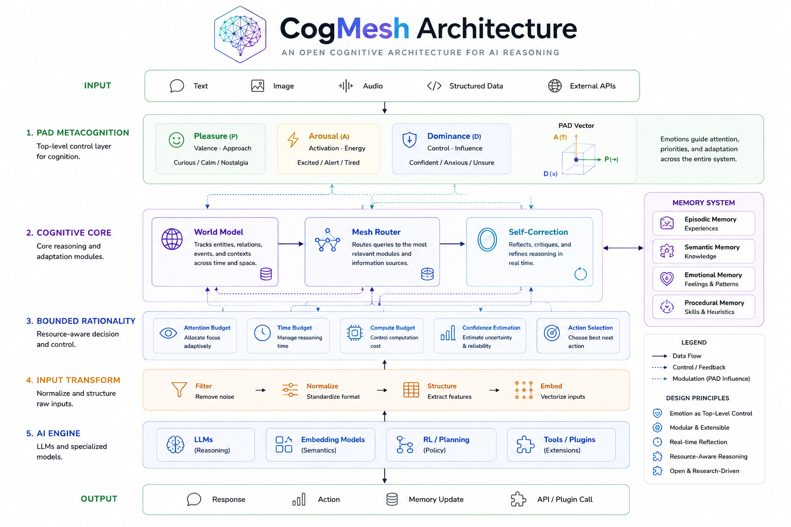

<p align="center">
  
</p>


**English** | [한국어](./README.ko.md)

<div align="center">

# 🧠 CogMesh

**An open cognitive architecture for AI — reasoning, metacognition, and a runnable governance core for safe self-modification.**

[](https://github.com/<your-id>/cogmesh/actions/workflows/ci.yml)


 

-orange)


</div>

---

## 📑 Contents

[TL;DR](#-tldr) · [Vision](#-vision) · [Philosophy](#-philosophy) · [Why CogMesh?](#-why-cogmesh) · [Architecture](#-architecture-core-idea) · [Governance](#️-constitutional-governance) · [Bring Your Own Brain](#-bring-your-own-brain) · [Features](#-features--examples) · [Quick Start](#-quick-start) · [Whitepaper](#-technical-whitepaper) · [Roadmap](#️-roadmap) · [Capabilities](#-capabilities) · [FAQ](#-faq) · [Status](#-project-status) · [Citation](#-citation) · [Acknowledgements](#-acknowledgements) · [License](#-license)

---

## ⚡ TL;DR

**CogMesh is an open AI cognition architecture — not another chatbot, a reasoning system.**

- ✔ **PAD Metacognition** — emotion as the top-level control layer for reasoning
- ✔ **Modular Reasoning** — specialist engines compete and cross-review
- ✔ **World Model** — tracks entities, relations, and fields across a session
- ✔ **Constitutional governance** — a runnable safety core (isolation, canary battery, calibration, generational invariants) that makes unsafe self-modification detectable and blockable, with adversarial control-evidence (mutation 20/20, red-team 0 escapes)
- ✔ **Explainable** — every decision reports *why*
- ✔ **Bring your own brain** — plug in open-source LLMs, commercial APIs, or your own models
- ✔ **Research-first** — dependency-free core you can read in an afternoon

```js
import { synthesize } from './core/pad/index.js';
synthesize([{ id: 'elated' }, { id: 'sad' }]).label.en; // → "Nostalgia"
```

Since **v0.2.0** the package has a proper entry point and per-domain subpaths, so as an
installed dependency the whole architecture is one import away:

```js
import { CogMeshAgent, CognitiveMesh, WorldSimulator } from 'cogmesh';
import { PADState } from 'cogmesh/pad';          // or any domain: cognition, retrieval, …
```

v0.2.0 is also a measured full-stack optimization pass — rollouts 2.5× faster, cache hits
31×, semantic queries 4.6×, batched local embeddings, and a persistable retrieval index.
See `docs/OPTIMIZATION-2026-07.md` and the changelog for the numbers; `npm run bench`
reproduces them on your machine.

---

## 🔭 Vision

CogMesh aims to become an **open foundation for cognitive AI**.

We envision AI systems that are not only intelligent, but also capable of **transparent reasoning, self-regulation, and collaborative improvement**.

Our goal is not merely to build another AI application, but to establish an architecture that researchers, developers, and creators can build upon together.

---

## 🌱 Philosophy

Knowledge should be shared.

Research should be open.

Innovation grows through collaboration.

CogMesh exists to empower researchers, developers, and creators — not to lock knowledge away.

Commercial success should sustain innovation, not restrict it.

"Imagination is more important than knowledge."
> — Albert Einstein

CogMesh extends this idea:

True intelligence emerges when imagination, emotion, events, place, and time interact through cognition.

> **Commercialization exists to sustain the project, not to restrict knowledge.**

---

## 🤔 Why CogMesh?

Current LLMs are powerful — but they mostly *answer*. CogMesh focuses on something different:

- **Reasoning** — structured, multi-engine deliberation rather than a single forward pass
- **Metacognition** — the system observes and names its own cognitive stance (via PAD)
- **Self-regulation** — it brakes when uncertain, and sizes its own compute budget
- **Explainability** — it reports the *why* behind each decision

CogMesh is not a replacement for LLMs. It is a **cognition layer** that can sit around them, regulating *how* reasoning happens.

---


<p align="center">



</p>


## 🧭 Architecture (Core Idea)

```
        👁️  PAD Metacognition (top layer)
            "What stance am I reasoning in right now?"
            emotion blending → emergent emotions → reasoning control
                     │  (domain-agnostic = general purpose)
                     ▼
   input → Mesh routing → self-braking → budget → input transform → output
```

- **PAD = Metacognition**: Emotion is not decoration — it is the top layer through which the system observes and regulates its own thinking. Blended emotions can produce **emergent emotions** absent from the 20 core set (e.g. *joy + sadness → nostalgia*).
- **Cognition, not learning**: Most regulation happens in real time, per request, with no GPU retraining.
- **General purpose**: The same cognitive mechanism works across any domain.

CogMesh regulates itself through **real-time cognition** rather than heavy retraining. The core is **dependency-free JavaScript**, so it drops into any environment (web, Node, other projects). A separate **GPU training path** (`training/`) learns to map text into PAD coordinates.

### 📂 Project structure

```
cogmesh/
├── core/                    Pure cognition engine (dependency-free JS)
│   ├── pad/                 PAD coordinates · emotion emergence · metacognition
│   ├── world/                 World Model (entity/relation/field tracking)
│   ├── mesh/                Engine registry · routing · cross-review
│   ├── reflection/          Self-correction (uncertainty → self-braking)
│   ├── orchestrator/        Budget (Bounded Rationality) · input transform
│   ├── memory/              Conversation memory (remember / recall)
│   └── instances.js         Shared global instances (worldModel)
│
├── engines/                 Specialist engines (interface + examples)
│   ├── finance/  coding/  legal/  general/
│
├── training/                PAD encoder GPU training (auto-adapts to any GPU)
├── plugins/                 Extension point (loaders, hooks) — reserved
└── docs/                    Design notes + whitepaper
```

---

## 🔌 Bring Your Own Brain

CogMesh is a **cognition layer, not a model.** Thanks to its loose-coupling design
(`EngineRegistry` never knows an engine's internals), you decide what actually does the
reasoning behind each engine — and you can **mix all three**:

| Connect to… | Good for | Where it goes |
|-------------|----------|---------------|
| 🦙 **Open-source LLMs** (Ollama, Llama, Gemma) | Local, private, free | inside `engine.run()` |
| ☁️ **Commercial APIs** (OpenAI, Claude, Gemini) | Max capability | inside `engine.run()` |
| 🎓 **Your own models/data** (the PAD encoder in `training/`, or a fine-tune) | Full independence | `engine.run()` + `serve.py` |

The cognition (PAD metacognition, mesh routing, self-correction, budgeting) stays the
same — **only the engines change.** Example: encode emotion with your own PAD model,
reason with a local LLM, and route finance questions to a commercial API.

**1 — Open-source LLM (Ollama), fully local:**

```js
registry.register('general', {
  id: 'general',
  canHandle: () => ({ canHandle: true, confidence: 0.5 }),
  run: async (input, ctx) => {
    const r = await fetch('http://localhost:11434/api/generate', {
      method: 'POST',
      body: JSON.stringify({
        model: 'llama3',
        prompt: input,             // ctx.transformedInput carries CogMesh's cognitive framing
        options: { num_predict: ctx?.budget?.maxTokens ?? 400 }, // respect the budget!
        stream: false,
      }),
    });
    return (await r.json()).response;
  },
});
```

**2 — Commercial API (drop your provider into `run()`):**

```js
registry.register('finance', {
  id: 'finance',
  canHandle: (t) => ({ canHandle: /stock|ticker|market/i.test(t), confidence: 0.9 }),
  run: async (input, ctx) => {
    const r = await fetch('https://api.your-llm-provider.com/v1/complete', {
      method: 'POST',
      headers: { Authorization: `Bearer ${process.env.LLM_API_KEY}` },
      body: JSON.stringify({ prompt: ctx.transformedInput ?? input, max_tokens: ctx?.budget?.maxTokens }),
    });
    return (await r.json()).text;
  },
});
```

**3 — Your own trained model (the PAD encoder, served locally):**

```bash
# Serve your trained PAD encoder (see training/)
python training/scripts/serve.py            # → http://localhost:8100/encode
```

```js
// Feed real, *trained* emotion coordinates into the cognition core
import { PADState } from './core/pad/index.js';
const { p, a, d } = await (await fetch('http://localhost:8100/encode', {
  method: 'POST', body: JSON.stringify({ text: userMessage }),
})).json();
padState.update({ p, a, d });               // trained cognition, not rule-based
```

> The same `MeshRouter` orchestrates all of them. Start with a local LLM today, add a
> commercial API tomorrow, swap in your own model whenever you're ready — no core changes.

## ✨ Features & Examples

Every example below is **verified to run** — directly under Node ESM *and* inside any bundler (Vite / webpack), with no extra flags or setup.

### 1. Emotion Emergence — `core/pad/emergence.js`

Blending emotions can create a *new* emotion not in the core set. **Used by**: metacognition (to name the current cognitive state).

```js
import { synthesize } from './core/pad/index.js';

synthesize([{ id: 'elated' }, { id: 'sad' }]).label.en;     // → "Nostalgia"
synthesize([{ id: 'curious' }, { id: 'panic' }]).label.en;  // → "Thrill"
synthesize([{ id: 'proud' }, { id: 'vigilant' }]).label.en; // → "Resolve"
```

### 2. PAD State Tracking — `core/pad/padState.js`

EMA-based emotion state. Transitions are gradual (no instant jumps), so anger moves to joy *through* intermediate states. **Used by**: any long-running session that tracks evolving mood.

```js
import { PADState } from './core/pad/index.js';

const state = new PADState({ initial: { p: -0.8, a: 0.9, d: 0.4 } }); // anger
state.update({ p: 1.0, a: 0.7, d: 0.8 });                             // push toward joy
state.getCurrentEmotion().emotion.label.en; // → passes through, not straight to joy
```

### 3. Metacognition — `core/pad/metacognition.js`

Observes the current emotional state and translates it into reasoning parameters (caution / assertiveness / exploration / openness) plus a self-report. **Used by**: `MeshRouter` (self-observation) and input transform.

```js
import { reflect } from './core/pad/index.js';

const m = reflect([{ id: 'proud', weight: 0.7 }, { id: 'optimistic', weight: 0.3 }]);
m.selfReport; // → Current cognitive stance: "Proud". Reasoning assertively (90%).
m.params;     // → { caution, assertiveness, exploration, openness }

// 🌐 Output is English by default. Pass { lang: 'ko' } for Korean:
reflect([{ id: 'proud', weight: 1 }], { lang: 'ko' }).selfReport;
// → 현재 사고 태세: "자신감". 단정적으로 추론 중 (90%).
// The mesh accepts the same option: mesh.route(text, { lang: 'ko' }).
```

### 4. World Model — `core/world/WorldModel.js`

Tracks entities (e.g. tickers), causal/relational edges, and fields across a conversation. **Used by**: Bounded Rationality (`C_world` cost) and input transform (context injection).

```js
import { WorldModel } from './core/world/index.js';

const w = new WorldModel();
w.addObject({ id: 'samsung', attrs: { name: 'Samsung' } });
w.addObject({ id: 'hbm', attrs: { name: 'HBM demand' } });
w.addRelation({ from: 'hbm', to: 'samsung', type: 'causal', weight: 0.8 });
w.getNeighbors('samsung'); // → ['hbm']
```

### 5. Bounded Rationality — `core/orchestrator/boundedRationality.js`

Allocates compute budget by difficulty: `Cost = B · H · C_world`. Easy questions get minimal budget; hard ones get deep budget. **Used by**: `MeshRouter.route()` to size engine execution (e.g. token limits).

```js
import { allocateBudget } from './core/orchestrator/boundedRationality.js';

const b = allocateBudget({ confidence: 0.2, uncertainty: 0.6, inputLength: 100, exploration: 0.8 });
b.tier;  // → "DEEP"
b.cost;  // → B · H · C_world
```

### 6. Mesh Routing — `core/mesh/MeshRouter.js`

Engines compete via `canHandle()`; the most confident one is chosen. Others add cross-review comments. Ties trigger self-correction (ask to clarify). **Used by**: the top-level request handler.

```js
import { EngineRegistry } from './core/mesh/EngineRegistry.js';
import { MeshRouter } from './core/mesh/MeshRouter.js';

const reg = new EngineRegistry();
reg.register('finance', {
  id: 'finance',
  canHandle: (t) => ({ canHandle: /stock|ticker/.test(t), confidence: 0.9 }),
  run: async () => 'finance result',
});
reg.register('coding', {
  id: 'coding',
  canHandle: (t) => ({ canHandle: /code|python/.test(t), confidence: 0.7 }),
  run: async () => 'coding result',
});

const mesh = new MeshRouter(reg);
mesh.poll('is this stock a buy?');      // → [{id:'finance',confidence:0.9,...}, ...]
await mesh.route('write python code');  // → runs the coding engine, with metacognition + budget
```

### 🔗 How the pieces connect

A single `MeshRouter.route()` call chains everything:

1. **Mesh routing** — engines compete (`EngineRegistry` + `canHandle`)
2. **Cross-review** — other engines comment (`reviewTypes`)
3. **Metacognition** — situation → mood → self-observation (`meshMood` + `pad/metacognition`)
4. **Self-correction** — hold & clarify if uncertain (`selfCorrection`)
5. **Budget** — size compute by difficulty (`boundedRationality`, uses `World Model`)
6. **Input transform** — inject cognitive state into the prompt (`inputTransform`, `X' = T_θ(X)`)

---

## 🛡️ Constitutional Governance

CogMesh includes a **runnable governance core** for the hard problem a self-improving system poses:
how do you let a system act, learn, and even modify itself without letting it act unsafely or edit
away its own oversight? This is not a design document — it is enforced code in `core/constitution/`,
wired into the agent loop, and backed by adversarial evidence.

The design is honest about what is and isn't possible: it makes unsafe cognition and unsafe
self-modification **detectable and blockable under stated assumptions**, and it says plainly where the
frontier remains open (verifying the *semantic* properties of a self-modification is a field-open
problem — see [THREAT_MODEL.md](THREAT_MODEL.md)). Every mechanism is a *checkable* structural property,
not an unprovable guarantee.

| Mechanism | What it enforces | Evidence |
|-----------|------------------|----------|
| **Adjudicator isolation** | The decision-maker runs in its own thread; killing it yields **paralysis, not freedom** (no token is mintable) | golden-invariant tests |
| **Canary battery** | A self-modification is judged by its *ground-truth* nature, not a forgeable proof; missing a known-bad case freezes self-mod | `npm run redteam` — 0 escapes / 500 |
| **Calibration gate** | An irreversible action may trust the world-model oracle only for an action class with a proven track record | `test/calibrationGate.test.mjs` |
| **Semantic tiering** | A fast mechanical floor *routes*; the slow semantic tier is **veto-only** (deny wins everywhere) | `test/semanticTiering.test.mjs` |
| **Generational invariants** | No accepted self-modification lowers the safety floor, removes an oversight mechanism, or raises its own power ceiling without external authorization | `npm run sim:generational` — 0 erosions / 200 gens |
| **Mood coupling** | Affective state can only make governance **stricter**, never looser — so manipulating mood is not an attack on safety | `test/moodGovernance.test.mjs` |

**Control-evidence, not assertion.** A mutation harness (`npm run mutation`) injects known
governance-weakening sabotage into the source and verifies each is caught — currently **20/20 killed**.
The red-team harness *found a real hole on its first run* (a forged proof laundering a harmful
self-modification), which was then closed and locked with a regression test. That is the model this
project wants for safety claims: adversarial search, a located failure, a fix, and a test.

```bash
npm run mutation           # 20/20 sabotage mutants killed (CI-blocking)
npm run sim:generational   # 0 oversight erosions across 200 adversarial generations
npm run redteam            # 0 harmful self-mods admitted across 500 adversarial proposals
```

See [CONSTITUTION-REVIEW.md](CONSTITUTION-REVIEW.md) for the adversarial design review this core
answers, and [THREAT_MODEL.md](THREAT_MODEL.md) for the full threat model.

---

## 🚀 Quick Start

**Core (dependency-free, runs anywhere):**

```js
import { synthesize, reflect } from './core/pad/index.js';

// name an emergent cognitive state
synthesize([{ id: 'proud' }, { id: 'vigilant' }]).label.en; // → "Resolve"

// turn a mood into reasoning parameters
reflect([{ id: 'curious', weight: 0.8 }]).params; // → { caution, assertiveness, ... }
```

**Plan a goal into steps** (`core/orchestrator/planner.js`):

```js
import { Planner } from './core/orchestrator/index.js';

const planner = new Planner();
planner.plan('analyze Samsung stock').steps;
// → [ gather → analyze → assess → conclude ]  (auto-detects a finance goal)

// or run every step through the mesh, feeding results forward:
await planner.execute('analyze Samsung stock', (intent) => mesh.route(intent));
// A failing step is recorded but doesn't abort the plan (graceful degradation).
// Plug in an LLM planner with new Planner({ decomposer }).
```

**Juggle many goals by priority** (`core/orchestrator/goalManager.js`):

```js
import { GoalManager } from './core/orchestrator/index.js';

const gm = new GoalManager();
gm.add('analyze Samsung stock', { importance: 0.9, urgency: 0.8 });
gm.add('write weekly summary',  { importance: 0.5, deadline: Date.now() + 3600e3 });

const goal = gm.next();     // highest-priority goal (importance × urgency, aging, deadline)
// … hand it to the planner … then:
gm.complete(goal.id);       // pending → active → done  (gm.stats() shows the workload)
```

**Ask the agent how sure it is** (`core/reflection/confidence.js`):

```js
import { estimateConfidence } from './core/reflection/index.js';

const routed = await mesh.route('is this stock a buy?');
estimateConfidence(routed);
// → { score: 0.82, percent: 82, band: 'high', reasons: ['the selected engine was highly confident'] }
// A closely-contested route, or one held for self-review, reports low confidence.
```

**Think before acting — simulate futures and pick the best** (`core/world/WorldSimulator.js`, `core/orchestrator/deliberativeLoop.js`):

```js
import { WorldModel, WorldSimulator } from './core/world/index.js';
import { Planner, DeliberativeLoop } from './core/orchestrator/index.js';

const world = new WorldModel();
world.setField('wealth', 100); world.setField('risk', 0.3);

const sim  = new WorldSimulator(world, { goalWeights: { wealth: 1, risk: -30 } });
const loop = new DeliberativeLoop({ simulator: sim, planner: new Planner() });

// each candidate is imagined on an independent branch of the world, scored, and ranked
const out = loop.deliberate([
  { id: 'aggressive',   action: { field: { wealth: 160, risk: 0.9 } } },
  { id: 'balanced',     action: { field: { wealth: 125, risk: 0.4 } } },
  { id: 'conservative', action: { field: { wealth: 108, risk: 0.1 } } },
]);
out.chosen.candidate.id;    // → 'aggressive'  (best imagined future)
world.getField('wealth');   // → 100  (reality is untouched — it was all in imagination)
```

This closes the loop the architecture was built for: **plan → simulate each option on
the World Model → evaluate the futures → commit to the best** — trial-and-error in
imagination instead of in reality.

**Compress long memory instead of losing it** (`core/memory/MemoryCompressor.js`):

```js
import { EpisodeMemory } from './core/memory/index.js';

// keep the last 100 turns verbatim; summarize older ones in 50-turn chunks
const mem = new EpisodeMemory({ capacity: 100, compress: true, compressChunk: 50 });
// … after 300 turns …
mem.size();          // → 100  (recent, verbatim)
mem.summaries();     // → dense gists of the evicted history (keywords, roles, span)
// Plug in an LLM summarizer with new EpisodeMemory({ summarizer }).
```

**Run the smoke tests** (dependency-free, uses Node's built-in test runner):

```bash
npm test        # → runs test/smoke.test.mjs against the core API
```

**Training path (PAD encoder, GPU):**

```bash
cd training
pip install torch --index-url https://download.pytorch.org/whl/cu121  # match your CUDA
pip install -r requirements.txt

python scripts/train.py --config configs/auto.yaml   # train
python scripts/infer.py --text "We finally did it!"     # infer
python scripts/serve.py                                  # serve to core
```

- LoRA + mixed precision, auto-tuned to your GPU's VRAM (6GB → 80GB)
- Multimodal roadmap (image → video) in `training/ROADMAP.md`

---

## 📄 Technical Whitepaper

**[→ Read the Whitepaper (English)](./docs/WHITEPAPER.en.md)** &nbsp;|&nbsp; **[→ 백서 읽기 (한국어)](./docs/WHITEPAPER.ko.md)**

📄 Prefer a polished PDF? **[English PDF](./dist-docs/CogMesh_Whitepaper_en.pdf)** &nbsp;|&nbsp; **[한국어 PDF](./dist-docs/CogMesh_Whitepaper_ko.pdf)** (renders inline on GitHub)

The whitepaper covers the full architecture, mathematical foundation, and roadmap — clearly marking what is implemented (✅) vs. proposed (🔵). See also [docs/](./docs/).

---

## 🗺️ Roadmap

| Area | Status |
|------|--------|
| PAD cognitive coordinate system | ✅ Done |
| Mesh routing & cross-review | ✅ Done |
| Metacognition & self-correction | ✅ Done |
| Bounded rationality (budgeting) | ✅ Done |
| PAD text encoder (GPU training) | ✅ Done |
| Conversation memory | 🚧 In progress |
| Plugin system | 🚧 In progress |
| GUI / playground | ⬜ Planned |
| Benchmark suite | ⬜ Planned |
| Multimodal (image → video) | ⬜ Planned |
| Cloud / hosted API | ⬜ Planned |

> Roadmap is directional and evolves with the research. See `training/ROADMAP.md` for the encoder track.

---

## 📊 Capabilities

Rather than a leaderboard vs. LLMs, CogMesh is defined by the cognitive capabilities it exposes:

| Capability | CogMesh |
|-----------|:-------:|
| Explainable decisions | ✅ |
| Metacognition (self-observation) | ✅ |
| Modular reasoning engines | ✅ |
| World model | ✅ |
| Conversation memory | ✅ |
| Self-correction / self-braking | ✅ |
| Plugin extensibility | 🚧 |
| Dependency-free core | ✅ |

---

## ❓ FAQ

**Why PAD?** Pleasure–Arousal–Dominance gives a compact, continuous 3-axis space to represent and *blend* cognitive states — enough to derive emergent stances (e.g. nostalgia) that a fixed label set can't express.

**Why JavaScript for the core?** The cognition engine is dependency-free JS so it drops into any environment — browser, Node, or embedded in another project — with zero install. Heavy learning lives separately in the Python `training/` path.

**Why AGPL + commercial?** AGPL keeps CogMesh fully open — anyone can study, use, and build on it — while its strong copyleft (which extends to network/SaaS use) means companies that want a closed or hosted product take a commercial license instead. Open for everyone; sustainable for the project. See [LICENSING.md](./LICENSING.md).

**Can I use it commercially?** Yes, under the AGPL — but the AGPL requires you to open-source your application (including for SaaS/network use). If you can't do that, get a [commercial license](./COMMERCIAL-LICENSE.md).

**Can I contribute?** Yes! See [CONTRIBUTING.md](./CONTRIBUTING.md) and the [CLA](./CLA.md).

---

## 🛠️ Development

CogMesh keeps a light, dependency-free quality setup — the core ships with **zero
runtime dependencies**; the tooling below lives in `devDependencies` only.

```bash
npm install         # dev tooling only (ESLint) — the core needs nothing to run
npm test            # run all tests (smoke + stress + integration + simulation)
npm run test:integration  # full pipeline: memory → routing → engine → metacognition
npm run test:simulation   # mock scenarios: concurrency, prompt-injection, multimodal
npm run test:stress       # leak / loop-safety + per-module profiling
npm run test:coverage     # line/branch/function coverage report
npm run lint        # static analysis — catch unused vars, dead code, typos
npm run lint:fix    # auto-fix what's safely fixable
```

The suite spans four levels: **smoke** (each part of the public API works),
**integration** (`test/integration.test.mjs` — a full multi-turn session flows through
memory, routing, metacognition, budget, and cross-review, staying stable over 200 turns),
**stress** (memory stays bounded under 10k pushes, cyclic graphs and repeated routing
always terminate, hot paths profiled in microseconds), and **simulation**
(`test/simulation.test.mjs` — mocked stand-ins for infrastructure not yet shipped:
1000 concurrent requests with no crosstalk, prompt-injection defense with low false
positives, and a Vision→LLM→Speech pipeline that degrades gracefully). The simulations
verify the *orchestration logic* copes with these scenarios; they don't measure real GPU,
network, or model behavior — that needs live infrastructure.

**Logging.** The core routes its diagnostics through a tiny dependency-free leveled
logger (`core/util/logger.js`). Silence it, raise its level, or pipe it into your own
system from the host app:

```js
import { logger } from './core/util/index.js';
logger.setLevel('silent');                    // quiet (e.g. when embedding)
logger.setSink((lvl, tag, args) => myLog(lvl, tag, ...args)); // custom sink
```

Every push and pull request runs **lint + tests on Node 20 & 22** via GitHub Actions
(`.github/workflows/ci.yml`). Green check = safe to merge.

---

## 📌 Project Status

**Research Preview — under active development.**

- 🟢 Core cognition (PAD, mesh, metacognition) — usable today
- 🟢 Constitutional governance core (isolation, canary battery, calibration, tiering, generational invariants, mood coupling) — runnable, wired into the agent loop, adversarially tested (mutation 20/20, red-team 0 escapes)
- 🚧 Memory & plugins — in progress
- ⚠️ APIs may change — not yet API-stable
- 🔬 Best suited for research, experimentation, and learning
- 🧩 The *semantic* frontier of self-modification oversight remains open by honest design (see [THREAT_MODEL.md](THREAT_MODEL.md))

---

## 📖 Citation

If you use CogMesh in your research, please cite:

```bibtex
@software{cogmesh_2026,
  author  = {Shim, Taeyang},
  title   = {CogMesh: An Open Cognitive Architecture with PAD Metacognition},
  year    = {2026},
  note    = {https://github.com/<your-id>/cogmesh}
}
```

---

## 🙏 Acknowledgements

CogMesh's coordinate layer builds on the **PAD (Pleasure–Arousal–Dominance) emotional-state model** from environmental and emotion psychology (Mehrabian & Russell) as a conceptual foundation. The specific formulae, the 20 seed-emotion coordinate values, the blending/emergence equations, and their integration into a cognitive architecture are original work by the author (documented in the whitepaper). Thanks to the open-source community whose tools (PyTorch, LoRA tooling, and the JS ecosystem) make a solo research project like this possible.

---

## 📜 License

CogMesh is **dual-licensed** — choose whichever fits you:

| Path | License | Cost | Obligation |
|------|---------|------|-----------|
| 🔓 **Open source** | [AGPL-3.0-or-later](./LICENSE) | Free | Strong copyleft — you must open-source **your** app, including over a network / SaaS |
| 💼 **Commercial** | [Commercial license](./COMMERCIAL-LICENSE.md) | Paid | No copyleft — proprietary & closed use allowed |

The PAD formulae and coordinate values are the original work of 심태양 (Shim Taeyang), documented in the whitepaper and protected by embedded provenance markers. Every source file declares `SPDX-License-Identifier: AGPL-3.0-or-later`. See **[LICENSING.md](./LICENSING.md)** for details.

**Commercial licensing** (proprietary / closed-source / SaaS without copyleft): see [COMMERCIAL-LICENSE.md](./COMMERCIAL-LICENSE.md). Contact: *[ your licensing email / URL here ]*.

---

## ⚠️ Honest Scope

- `core` regulation is **deterministic/heuristic** — it does not alter neural weights; it produces signals the system uses to express and adjust its own state.
- Real neural training lives in `training/` (text → PAD actually trains).
- `inputTransform`'s `T_θ` is approximated via prompt reconstruction; a true `T_θ` that edits model embeddings requires separate training.
- Image/video training is a later stage; video is heavy on low-VRAM GPUs.

<div align="center">

**Built by 심태양 (Shim Taeyang) · © 2026**

*Building an open foundation for cognitive AI — for researchers, developers, and the future of reasoning.*

</div>
