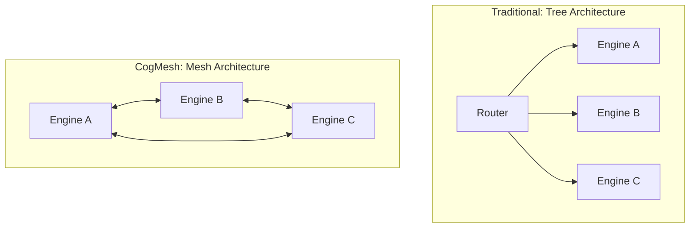
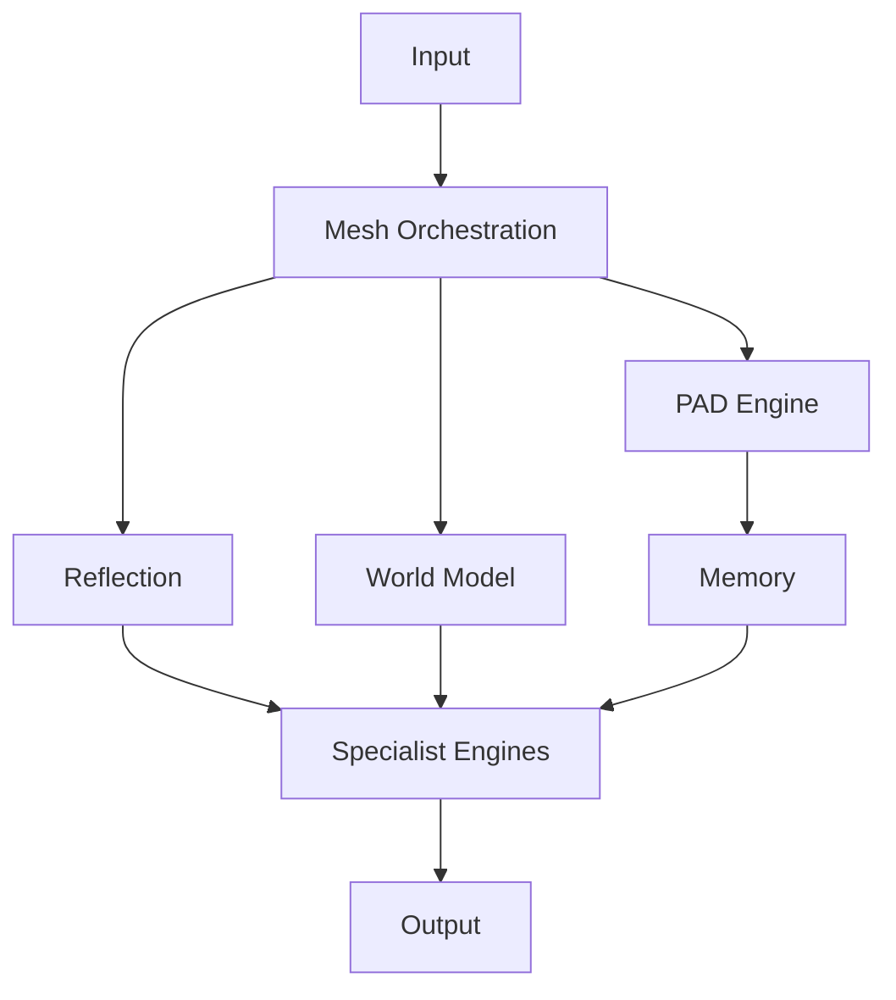

# CogMesh Technical Whitepaper

**CogMesh: A Mesh-Orchestrated Cognitive Architecture Integrating World Models, Distributed PAD Coordinates, and Modular Specialist Engines**

*Language: [한국어](./WHITEPAPER.ko.md) | **English***

---

| | |
|---|---|
| **Version** | 0.1 (Draft) |
| **Status** | Working Draft |
| **License** | PolyForm Noncommercial 1.0.0 |
| **Scope** | Clearly distinguishes what is *implemented* from what is *proposed* |

> **To the reader.** This whitepaper honestly separates *what is actually implemented*
> from *future plans*. ✅ marks code-verified behavior, 🟡 marks scaffolding only,
> 🔵 marks design/proposal stage. We do not fabricate benchmark numbers for evaluations
> that have not been run.

---

## Abstract

**Purpose.** Instead of entrusting everything to one giant model, CogMesh lets multiple
specialist engines collaborate like a **mesh**, with an **emotion coordinate system (PAD)**
on top that regulates the system's reasoning stance.

**Limitations of existing systems.** Most LLM applications today are one-way pipelines:
"input → prompt → output." Such a structure (1) does not know what it does not know,
(2) spends the same resources regardless of problem difficulty, and (3) cannot organically
combine multiple areas of expertise.

**Core idea.** CogMesh overcomes these limits along three axes.

- **Mesh Orchestration** — engines compete, verify, and complement each other.
- **World Model** — tracks objects, relations, and fields as world state.
- **PAD Coordinate** — places emotion in a 3-axis space, lets emotion blending *emerge new
  emotions*, and uses this as a **metacognitive layer** to regulate reasoning.

**Expected benefits.** An explainable, scalable, reusable general-purpose reasoning platform
that observes and regulates itself through **real-time cognition** rather than heavy retraining.

---

## 1. Introduction

### 1.1 Why CogMesh?

**Limits of a single LLM.** A single LLM is powerful, but weak at calibrating its own
confidence, verifying its answer from another perspective, or adjusting computation per problem.

**Limits of a single-model structure.** When one model tries to handle finance, coding, and
law all at once, each domain becomes shallow and accountability becomes unclear.

**Why a platform.** If intelligence is viewed as an **ecosystem of collaborating engines**
rather than one model, new expertise can be added by "adding an engine," and each engine can
be independently improved and reused.

### 1.2 Motivation

Four motivations behind CogMesh:

- **Explainability** — which engine was chosen and why, and what stance the system took, is
  visible at each step.
- **Scalability** — capability grows by adding engines and plugins.
- **Modular Intelligence** — intelligence is treated as replaceable, composable modules.
- **Reusability** — the pure core is not bound to UI or framework and drops in anywhere.

---

## 2. Design Philosophy

### 2.1 Intelligence as a Network

A traditional router distributes top-down to a single processor like a **tree**.
CogMesh is a **mesh**. Every engine evaluates and complements the others.



### 2.2 Self-Expanding Cognitive Ecosystem

- **Specialist Engines** — each domain expert registers with the registry.
- **Dynamic Growth** — capability grows by adding engines with no hardcoding.
- **Continuous Evolution** — rule-based cognition can be gradually replaced with learned cognition.

### 2.3 Core Principles

| Principle | Meaning |
|---|---|
| **Modularity** | Each capability is an independent module |
| **Decoupling** | The core does not depend on specific engine implementations (loose coupling) |
| **Reuse** | Pure logic is reusable anywhere |
| **Reflection** | Observes and corrects itself |
| **Evidence** | Evidence-based judgment |
| **Explainability** | Each step is explainable |

---

## 3. Overall Architecture

The full path a single request flows through.



The key point: a single `MeshRouter.route()` call chains the following six steps in order.

1. **Mesh routing** — select the primary engine by competition ✅
2. **Cross-review** — other engines comment from their perspective ✅
3. **Metacognition** — situation → emotional stance → self-observation ✅
4. **Self-braking** — ask to clarify if uncertain ✅
5. **Budget allocation** — scale computation by difficulty ✅
6. **Input transform** — inject cognitive state into the input ✅

---

## 4. Mesh Orchestration ✅

### Tree vs Mesh

A tree only distributes, but a mesh has engines **collaborate in a distributed way**.

- **Verification** — other engines evaluate the primary answer from their view
- **Critique** — comment on missing perspectives
- **Consensus** — the primary engine is decided by confidence
- **Convergence** — heavy contention triggers a clarification request via self-braking

### Behavior

```
"How's Samsung stock?"        → finance(0.9) vs coding(0)    → finance
"Write a sort in python"      → finance(0)   vs coding(0.67) → coding
"Backtest a stock in python"  → finance(0.5) vs coding(0.5)  → contention → clarify
```

Once the primary engine is chosen, other engines add supporting comments via `review()`.
For example, in a finance-led backtesting question, coding comments "adding a code example
may help" at 50% relevance.

> **Status.** Routing + cross-review implemented and verified ✅.
> `mesh_vote` (ensemble), `mesh_scheduler` (execution orchestration), `mesh_graph`
> (dependency graph) are at proposal stage 🔵.

---

## 5. World Model ✅

### Definition

World state is expressed at time `t` by three elements.


> **W_t = (O_t, R_t, F_t)**


### Object Layer


> **O_t = o_iᵗ, o_iᵗ = (s_iᵗ, e_i, Σ_iᵗ)**


- `s_iᵗ` : State — position, value, etc.
- `e_i` : Semantic embedding
- `Σ_iᵗ` : Uncertainty (covariance)

> **Status.** The current implementation is a deterministic store holding `state` and
> `attrs` ✅. Embedding/covariance fields are reserved in the schema; learning integration
> is at proposal stage 🔵.

### Relation Layer


> **R_t = r_ijᵗ, r_ijᵗ = (φ_ij, w_ij)**


- `φ_ij` : Relation type — **Causal / Functional / Spatial**
- `w_ij ∈ [0,1]` : Relation strength (probability)

### Field Layer


> **F_t(x) ∈ ℝ^k**


Continuous world representation. Currently implemented as a key-value approximation ✅.

### 5.5 World Dynamics — Temporal State Transition 🔵

**Definition.** The world is not a deterministic system but a **stochastic dynamical system**. Given
agent action `a_t`, the next world state follows a conditional distribution (proposed).


> **W_(t+1) ~ P(W_(t+1) | W_t, a_t)**


**Factorization (derivation).** Since `W_t = (O_t, R_t, F_t)`, the
joint distribution `P(W_(t+1)| W_t,a_t)` must in principle capture all interdependence
among `O_(t+1), R_(t+1), F_(t+1)`. We introduce a mean-field approximation —
each layer is updated only from its own inputs within one step (objects from their own past state,
neighbors, and the field; relations from the two endpoint objects; the field from the whole object set) —
under which the joint factorizes as:


> **P(W_(t+1) | W_t, a_t) = P_O(O_(t+1)| O_t,F_t,a_t) · P_R(R_(t+1)| O_t) · P_F(F_(t+1)| F_t,O_t)**


or simply `P = P_O · P_R · P_F`. This mirrors the node/edge/global-update split used in Graph
Neural Networks, and its practical justification is complexity: it reduces cost from `O(N²)` (full joint)
to `O(N)+O(E)` (independent per-layer updates). Each conditional is approximated deterministically by a
neural network `f_θ, g_θ, h_θ` (equivalent to taking the mean of a narrow Gaussian `P_O`):


> **Object Update: s_iᵗ⁺¹ = f_θ(s_iᵗ, N_iᵗ, F_t)**


> **Relation Update: w_ijᵗ⁺¹ = g_θ(o_iᵗ, o_jᵗ)**


> **Field Update: F_(t+1) = h_θ(F_t, O_t)**


where `N_iᵗ` is the neighbor set of object `i` (nodes `j` with `w_ijᵗ` above a threshold in
the relation graph).

> Learned transition functions `f_θ, g_θ, h_θ` require neural training and are at proposal
> stage 🔵. The current implementation approximates this with rule-based updates ✅.

### 5.6 Observation & Grounding — Connecting to Reality 🔵

**Observation model.** The agent cannot see `W_t` directly; it only observes an input generated
from it (text, logs, sensor values, etc.), `x_t`.


> **x_t ~ P(x_t | W_t)**


**Inverse inference (derivation).** What the agent actually needs is the reverse direction — estimating
the world from observations. Applying Bayes' rule recursively over time (the same structure as a Bayes
filter / Kalman / particle filter):


> **P(W_t | x_1:t) ∝ P(x_t | W_t) · P(W_t | x_(1:t-1))**


where `P(W_t | x_(1:t-1)) = ∫ P(W_t| W_(t-1),a_(t-1)) P(W_(t-1)| x_(1:t-1)) dW_(t-1)`
(predict with the §5.5 transition model, then correct with the §5.6 observation model — a predict–update
loop). In summary:


> **W_t ~ P(W_t | x_1:t)**


> **[ perception = world inference ]**


> That is, "perception" is not a separate module — it is defined as online Bayesian inference over the
> world model itself. The current implementation approximates this with deterministic parsing (entity
> extraction) ✅. Genuine probabilistic inference using covariance `Σ_iᵗ` is at proposal stage 🔵.

### 5.7 Agent Decision — Formalizing Choice 🔵

**Policy.** The agent observes the world state and produces a distribution over actions: `π(a_t | W_t)`.

**Objective.** The policy is chosen to maximize expected discounted cumulative reward.


> **max_π E[Σ_t=0^T γᵗ R(W_t, a_t)], γ∈[0,1)**


**Derivation to the Bellman equation.** Define the value function `V^π(W_t) = E_π[Σ_k=0^∞γ^k R(W_(t+k),a_(t+k))| W_t]`.
Splitting the sum into its first term and the remainder gives the recursive Bellman expectation equation:


> **V^π(W_t) = E[R(W_t,a_t) + γ V^π(W_(t+1))], W_(t+1)~ P( · | W_t,a_t)**


The optimal policy is `π*(a_t| W_t) = argmax_a E[R(W_t,a)+γ V*(W_(t+1))]`.
Adding the budget-cost term `β · Cost(π)` from §11 (Bounded Rationality) yields exactly the
policy equation already stated in §13, `π* = argmax_π E[R]-β Cost(π)` — i.e.,
§13's policy equation is this section's Bellman equation with a budget constraint added.

### 5.8 Future Rollout — Bounded Branching Planning 🔵

Because the world model is stochastic, the exact expectation `E[V^π]` has no closed form.
Instead we sample `B` candidate futures by Monte Carlo rollout.


> **W_(t+k)^((b))_b=1^B, W_(t+k)^((b)) ~ P( · | W_(t+k-1)^((b)), a_(t+k-1)^((b)))**


Each branch's value is accumulated to a finite horizon `H`:


> **V^((b)) = Σ_k=0^H γ^k R(W_(t+k)^((b)))**


and the branch with the highest value is selected.


> **a_t = argmax_b V^((b))**


**Approximation error (derivation).** As `B→∞, H→∞`, `1/BΣ_b V^((b)) → E[V^π(W_t)]`
(law of large numbers), and `max_b V^((b))` is an upward-biased estimator of this expectation — a
well-known approximation in Monte Carlo Tree Search (MCTS) and Model Predictive Control (MPC), whose bias
shrinks with `B` and `H`. The bound on `B` connects directly to the Budget concept in §11 — this is
**bounded optimal planning**: not the exact optimum, but the best approximation achievable within a given
compute budget.

### 5.9 Learning Loop — Training Objective 🔵

The parameters of the four networks (`f_θ,g_θ,h_θ` and policy `π_θ`) are trained to
minimize:


> **θ* = argmin_θ L, L = λ₁L_(pred) + λ₂L_(consist) + λ₃L_(value) + λ₄L_(entropy)**


Concrete definition of each term (proposed):

- **Prediction loss** — negative log-likelihood of the §5.6 observation model. `L_(pred) = -log P_θ(x_t | W_t)`, measuring how well the world model explains actual observations.
- **Consistency loss** — self-prediction error of the §5.5 field update. `L_(consist) = ‖ F_(t+1) - h_θ(F_t,O_t)‖₂²`, discouraging physical contradictions between consecutive states.
- **Value loss** — squared TD residual of the §5.7 Bellman equation. `L_(value) = (R(W_t,a_t)+γ V_θ(W_(t+1)) - V_θ(W_t))²`.
- **Entropy loss** — negative policy entropy bonus preventing premature convergence. `L_(entropy) = -H(π_θ( · | W_t))` (the same device used in maximum-entropy RL methods such as SAC).

### 5.10 Self-Correction — Uncertainty-Based Correction 🔵

**Entropy filter.** When the (differential) entropy `H(W_t)` of the belief distribution
`P(W_t| x_1:t)` exceeds a threshold `τ` — i.e., when "how much the system doesn't know"
exceeds an allowed limit — the inference is not adopted immediately; the system asks for clarification instead.


> **Reject if H(W_t) > τ**


**External anchor.** To prevent the world model from drifting under pure self-prediction, we penalize its
distance from accessible ground-truth data `W_(real)`.


> **L_(anchor) = D(W_t, W_(real))**


**Definition of the distance function `D` (proposed).** Since `W=(O,R,F)`,
`D` is defined as a weighted sum over the three layers:


> **D(W_t,W_(real)) = Σ_i KL(o_iᵗ ‖ o_i^(real)) [object belief divergence] + Σ_(i,j)(w_ijᵗ - w_ij^(real))² [relation strength error] + ‖ F_t - F_(real)‖₂² [field error]**


The object term is the KL divergence treating `o_iᵗ=(s_iᵗ,a_iᵗ,Σ_iᵗ)` as a Gaussian
`N(s_iᵗ,Σ_iᵗ)` (closed-form), while the relation and field terms are L2 errors.

> **Key point.** Fully autonomous (no external correction) ✗ — **anchored autonomy** with external
> reference included ✔. This is the theoretical basis for the "ask for clarification under uncertainty"
> principle already implemented as a cognition-based heuristic in the core's self-braking (§9) ✅. Its
> neural-loss-optimized version is at proposal stage 🔵.

### 5.11 Unified System Equation — Closed-Loop Definition 🔵

Combining the five components above (observation, inference, decision, transition, learning) into a
single closed loop, the "cognition" that CogMesh defines is fully summarized by four equations:


> **W_(t+1) ~ P(W_(t+1)| W_t, a_t) (world transition, §5.5)**
> **a_t ~ π(a_t | W_t) (policy, §5.7)**
> **π ∝ argmax E[R] (objective, §5.7–5.8)**
> **θ* = argmin L (learning, §5.9)**


**Closure argument.** These four equations form a cycle in which each is the others' input: world state
`W_t` feeds the policy; the policy's action `a_t` determines the next world state; the
prediction/observation error (§5.9) in turn updates the transition functions `f_θ,g_θ,h_θ`
and the policy `π_θ`. The entropy filter and anchor loss of §5.10 act as stabilizers that keep the
loop from diverging (drifting away from reality). This structure combines the world–controller loop of
World Models (Ha & Schmidhuber, 2018) with the belief-update–policy loop of a POMDP, and is expected to
converge to the standard Bellman-optimal policy `π*` in the limit `B,H→∞` with the `D( · , · )`
penalty going to zero — a direct combination of MCTS convergence results and POMDP Bellman optimality. We
present only a proof sketch here; a formal proof is left as future work 🔵.

> Currently only the "observe → infer → rule-based decide" path among the four equations runs
> deterministically ✅. Stochastic transitions, a learned value function, and entropy-based
> self-correction are all at proposal stage 🔵.

---

## 6. PAD Cognitive Coordinate System ✅

### PAD Theory

Every emotion is represented by three axes, each normalized to `[-1, +1]`.

- **P (Pleasure)** — pleasure/positivity
- **A (Arousal)** — arousal/activation
- **D (Dominance)** — dominance/control

### Coordinate Space


> **PAD = (P, A, D), P, A, D ∈ [-1, +1]**


### Emotion Dataset — 20 Seed Emotions ✅

20 core emotions are defined as coordinates (full table in **Appendix B**). Examples:

| Emotion | P | A | D |
|---|---|---|---|
| Elated | +1.0 | +0.7 | +0.8 |
| Angry | −0.8 | +0.9 | +0.4 |
| Panic | −0.9 | +1.0 | −0.7 |

### Emotion Composition — Linear Blend ✅

Blend multiple emotions by weighted average to make a new point in coordinate space.


> **blended = (Σ_i w_i · coord_i)/(Σ_i w_i)**


### Emergent Emotion — Non-linear Emergence ✅

When the blended point fits none of the 20 cores well (distance > 0.55), an **unnamed new
emotion** emerges. Certain pairs jump qualitatively.

| Combination | Emergent emotion |
|---|---|
| Joy + Sadness | **Nostalgia** |
| Curiosity + Fear | **Thrill** |
| Pride + Vigilance | **Resolve** |

This is the actual implementation of the core idea that "emotion blending creates new emotions."

### Dynamic PAD Update ✅

Emotion change over time is updated by exponential moving average (EMA).


> **S_t = S_(t-1) · λ + Δ v · α, λ + α ≤ 1**


Because of this, emotion does not jump abruptly but moves gradually through intermediate states.

---

## 7. Cognitive Mesh ✅🔵

Distributed reasoning through inter-engine communication.

- **Engine Communication** — registration/lookup via registry ✅
- **Bidirectional Interaction** — primary ↔ reviewer engines, two-way ✅
- **Distributed Reasoning** — combine multiple engine perspectives ✅
- **Distributed PAD** — per-engine PAD stance (proposed) 🔵
- **Consensus Formation** — confidence-based consensus ✅
- **Conflict Resolution** — clarify via self-braking on contention ✅

> "Distributed PAD," where each engine holds its own PAD state, is in the design but the
> system currently operates with a single stance 🔵.

---

## 8. Memory Architecture ✅🟡

Designed in five kinds, modeled after human memory.

| Kind | Role | Status |
|---|---|---|
| **Working Memory** | Immediate conversation context (short-term) | ✅ implemented |
| **Episodic Memory** | Time-ordered episodes (when what was said) | ✅ implemented |
| **Semantic Memory** | Facts and concepts (key-value) | ✅ implemented |
| **Reflection Memory** | Past cognitive stance / self-reflection | ✅ implemented |
| **Knowledge Memory** | External knowledge (RAG etc.) integration | 🔵 proposed |

> The four kinds — Working/Episodic/Semantic/Reflection — are implemented and verified as
> modules ✅. Automatic pipeline integration (remember/recall each turn) is next 🟡.

---

## 9. Reflection Engine ✅

The system checks its own answer.

- **Self Critique** — recognize uncertainty and self-brake
- **Evidence Review** — reflect other engines' evidence comments
- **Consistency Check** — check consistency of situation and stance
- **Confidence Calibration** — calibrate confidence

**Self-braking rule** (combining three cognition signals instead of neural entropy):


> **uncertainty = 0.5 (1 - c_top) + 0.3 contention + 0.2 caution**


If `uncertainty` exceeds threshold `τ = 0.6`, a clarification question is returned instead
of an answer.

---

## 10. Dynamic Scaling ✅

Allocate compute resources by problem difficulty — **"intelligence = performance − compute cost."**


> **π* = argmax_π E[R] - β · Cost(π), Cost = B · H · C_(world)**


- **Adaptive Computation** — decide budget tier by difficulty (MINIMAL–DEEP) ✅
- **Variable Reasoning Depth** — adjust search depth `H`, branching `B` ✅
- **Computation Reuse / Cache** — reuse repeated computation 🔵 (partially via web app cache)

Example: "hi" → Cost 1.0 (minimal), complex multi-scenario → Cost 20.0 (deep).

---

## 11. Specialist Engines ✅🔵

Domain engines registered with the registry.

| Engine | Status |
|---|---|
| **Finance** | ✅ example interface (real analysis implemented in web app history) |
| **Coding** | ✅ example interface |
| **Legal / General** | 🟡 placeholder |
| **Medical / Science / Robotics / Vision / Audio** | 🔵 future engines |

Every engine follows the same interface (`canHandle` / `run` / `review`). A new domain plugs
into this spec and the core orchestrates it as is.

---

## 12. Training Pipeline ✅🟡

Actually trains an encoder mapping text to PAD coordinates (`training/`).

- **PAD Encoder** — multilingual MiniLM + LoRA + PAD regression head ✅
- **Training Dataset** — 20-emotion seed data (Appendix B) ✅
- **Inference / Serving** — inference and HTTP serving scripts ✅
- **Fine-tuning** — LoRA + mixed precision on RTX 4050 (6GB) ✅
- **Model Replacement** — replace rule-based PAD with the learned encoder (same output space) ✅

> Image → video extension is the next roadmap stage 🔵 (video is heavy for 6GB; see ROADMAP).

---

## 13. Mathematical Foundation

Core formulas (full set in **Appendix A**).

**World Model**

> **W_t = (O_t, R_t, F_t), W_(t+1) ~ P(W_(t+1) | W_t, a_t)**


**PAD Dynamics**

> **S_t = S_(t-1)λ + Δ v α, λ + α ≤ 1**


**Emergence (nearest emotion)**

> **Emotion = argmin_i ‖ PAD - PAD_i ‖₂**


**Dynamic Scaling**

> **Cost = B · H · C_(world)**


**Reflection (self-braking)**

> **Reject if uncertainty > τ**


**Mesh Consensus**

> **engine* = argmax_e confidence_e(input)**


---

## 14. Engineering Architecture ✅

```
cogmesh/
├── core/       Core (pad · world · mesh · memory · reflection · orchestrator)
├── engines/    Specialist engines (registered via Registry)
├── training/   PAD encoder training
├── plugins/    Plugin System (extension point) 🔵
└── docs/       Documentation
```

- **Registry** — dynamic engine registration/lookup ✅
- **Plugin System** — pipeline hooks (proposed) 🔵
- **Data Contract / API / Interface** — engine interface spec ✅ (Appendix D, E)

Directory details in **Appendix C**.

---

## 15. Implementation Roadmap

| Stage | Content | Status |
|---|---|---|
| **Sprint 1–8** | Finance app foundation (Tool Router, Evidence, KB) | ✅ |
| **Sprint 9–10** | Engine structure split · Engine Registry | ✅ |
| **Sprint 11–12** | PAD · World Model | ✅ |
| **Sprint 13–14** | Coding engine · Mesh routing | ✅ |
| **Sprint 15** | UI wiring · cross-review · World integration | ✅ |
| **Sprint 16–17** | PAD metacognition · Mesh connection | ✅ |
| **Sprint 18–20** | Self-braking · budget · input transform | ✅ |
| **Training** | PAD encoder GPU training path | ✅ |
| **Future** | Multimodal · distributed PAD · mesh_vote | 🔵 |

---

## 16. Experimental Results (Initial Verification)

> **Honest note.** The following are **functional verification** results, not formal benchmarks.
> Standardized quantitative evaluation (accuracy, latency, reasoning quality) is **future work** 🔵.

| Item | Verified | Result |
|---|---|---|
| **Emotion Emergence** | Joy+Sadness → Nostalgia, etc. | ✅ pass |
| **PAD Transition** | Passes through intermediate states anger→joy | ✅ pass |
| **Mesh Routing** | Correct per-domain engine selection | ✅ pass |
| **Self-Correction** | Clarify triggers on contention (0.5:0.5) | ✅ pass |
| **Budget Allocation** | Cost 1.0–20.0 tiered by difficulty | ✅ pass |
| **Memory** | 4-kind memory and recall | ✅ pass |

- **Performance / Latency / Accuracy / Reasoning Quality / Memory Reuse / PAD Evaluation**
  — formal measurement is future work 🔵.

---

## 17. Future Work 🔵

- **Adaptive PAD Learning** — replace rule-based PAD with the learned encoder (stage 1 in progress)
- **Autonomous Engine Generation** — auto-generate needed domain engines
- **Self-Growing Mesh** — reconfigure engine relations on its own
- **Continual Learning** — keep learning without forgetting
- **Hardware Optimization** — explore efficient inference (e.g., dedicated acceleration)

---

## 18. Conclusion

**Summary.** CogMesh combines mesh orchestration, world model, and PAD metacognition into a
general-purpose reasoning core that observes and regulates itself through **real-time cognition**
without heavy retraining.

**Contribution.** (1) Elevating emotion from decoration to a **metacognitive layer**,
(2) a mechanism that **emerges new emotions** from emotion blending, (3) a **mesh** structure
where engines collaborate, (4) clear separation of pure core and training.

**Future Vision.** Seven core axes — World Model · PAD · Reflection · Self-Correction · Mesh ·
Dynamic Scaling · Engine Registry — meshing together into a growing cognitive ecosystem.

---

## Appendix A — Complete Mathematical Formalism

> Full derivations live in **§5 World Model**. This appendix is a quick-reference formula sheet;
> follow the section numbers (§) next to each equation for definition → derivation → (approximate) proof.

### A.1 State Space (§5.1–5.4)


> **W_t = (O_t, R_t, F_t)**


> **O_t = o_iᵗ_i=1^N, o_iᵗ = (s_iᵗ, a_iᵗ, Σ_iᵗ)**


> **R_t = r_ijᵗ, r_ijᵗ = (φ_ijᵗ, w_ijᵗ), w_ijᵗ ∈ [0,1]**


> **F_t(x) ∈ ℝ^k**


### A.2 World Dynamics (§5.5)


> **W_(t+1) ~ P(W_(t+1) | W_t, a_t) = P_O · P_R · P_F (conditional-independence approximation, see derivation)**


> **s_iᵗ⁺¹ = f_θ(s_iᵗ, N_iᵗ, F_t) w_ijᵗ⁺¹ = g_θ(o_iᵗ, o_jᵗ) F_(t+1) = h_θ(F_t, O_t)**


### A.3 Observation & Grounding (§5.6)


> **x_t ~ P(x_t | W_t) W_t ~ P(W_t | x_1:t) ∝ P(x_t| W_t)P(W_t| x_(1:t-1))**


### A.4 Agent Decision (§5.7)


> **π(a_t | W_t), max_π E[Σ_t=0^Tγᵗ R(W_t,a_t)]**


> **V^π(W_t) = E[R(W_t,a_t) + γ V^π(W_(t+1))] (Bellman expectation equation, see derivation)**


> **π* = argmax_π E[R] - β Cost(π), Cost = B · H · C_(world)**


### A.5 Future Rollout — Bounded Planning (§5.8)


> **W_(t+k)^((b))_b=1^B, V^((b)) = Σ_k=0^Hγ^k R(W_(t+k)^((b))), a_t = argmax_b V^((b))**


### A.6 Learning Loop (§5.9)


> **θ* = argmin_θ L, L = λ₁L_(pred) + λ₂L_(consist) + λ₃L_(value) + λ₄L_(entropy)**


> **L_(pred) = -log P_θ(x_t| W_t) L_(consist) = ‖ F_(t+1)-h_θ(F_t,O_t)‖₂²**


> **L_(value) = (R(W_t,a_t)+γ V_θ(W_(t+1))-V_θ(W_t))² L_(entropy) = -H(π_θ( · | W_t))**


### A.7 Self-Correction (§5.10)


> **Reject if H(W_t) > τ**


> **L_(anchor) = D(W_t, W_(real)) = Σ_i KL(o_iᵗ‖ o_i^(real)) + Σ_(i,j)(w_ijᵗ-w_ij^(real))² + ‖ F_t-F_(real)‖₂²**


### A.8 Unified System Equation — Closed-Loop CogMesh Definition (§5.11)


> **W_(t+1) ~ P(W_(t+1)| W_t, a_t)**
> **a_t ~ π(a_t | W_t)**
> **π ∝ argmax E[R]**
> **θ* = argmin L**


### A.9 PAD & Mesh (§6, §11, §13 — prior formulas)


> **S_t = S_(t-1)λ + Δ v α, λ + α ≤ 1, S_t ∈ [-1,1]**


> **blended = (Σ_i w_i coord_i)/(Σ_i w_i)**


> **Emotion = argmin_i ‖ PAD - PAD_i ‖₂**


---

## Appendix B — PAD Coordinate Table (20 Seed Emotions)

| # | Emotion (EN / KO) | P | A | D |
|---|---|---|---|---|
| 1 | Elated 환희 | +1.0 | +0.7 | +0.8 |
| 2 | Serene 평온 | +0.6 | −0.6 | +0.4 |
| 3 | Proud 자신감 | +0.7 | +0.3 | +1.0 |
| 4 | Excited 흥분 | +0.8 | +0.1 | +0.5 |
| 5 | Relieved 안도 | +0.5 | −0.5 | +0.3 |
| 6 | Grateful 감사 | +0.9 | −0.2 | +0.2 |
| 7 | Optimistic 낙관 | +0.7 | +0.3 | +0.6 |
| 8 | Awe 경외 | +0.8 | +0.4 | −0.2 |
| 9 | Curious 호기심 | +0.4 | +0.6 | +0.2 |
| 10 | Angry 분노 | −0.8 | +0.9 | +0.4 |
| 11 | Lethargic 무기력 | −0.6 | −0.9 | −0.8 |
| 12 | Ashamed 수치심 | −0.7 | −0.2 | −0.1 |
| 13 | Sad 슬픔 | −0.8 | −0.4 | −0.6 |
| 14 | Disgust 혐오 | −0.9 | +0.2 | +0.1 |
| 15 | Tense 긴장 | −0.2 | +0.8 | −0.3 |
| 16 | Puzzled 당혹 | −0.1 | +0.5 | −0.2 |
| 17 | Bored 지루함 | −0.3 | −0.7 | −0.2 |
| 18 | Envy 질투 | −0.6 | +0.4 | −0.5 |
| 19 | Panic 공포 | −0.9 | +1.0 | −0.7 |
| 20 | Vigilant 경계 | −0.2 | +0.6 | +0.3 |

---

> **© 2026 심태양 (Shim Taeyang) — Original work.** The twenty (P, A, D) coordinate
> values in this table, together with the blend / nearest-emotion / emergence /
> EMA formulae in §6 and Appendix A, are original works authored by 심태양.
>
> CogMesh is **dual-licensed**: free and open source under **AGPL-3.0-or-later**, or
> a **commercial license** for use without AGPL's copyleft (see `LICENSE`,
> `COMMERCIAL-LICENSE.md`). You are free to use and reproduce these values and
> formulae under the AGPL — provided you comply with its terms (including releasing
> the source of any work that conveys or network-serves a derivative). Use outside
> those terms requires a commercial license.
>
> 🛡️ **Provenance-protected.** The distributed image versions of this table and the
> formula figures carry invisible steganographic signatures and unique canary
> patterns encoding `Copyright 심태양`. Any capture or screenshot retains these
> markers; their presence is evidence of origin and authorship.

**Provenance-marked figure versions** — the images below carry
invisible LSB, DCT, and canary markers; any capture retains them:


## Appendix C — Directory Structure

```
cogmesh/
├── core/
│   ├── pad/          emotionMap · nearestEmotion · padState
│   │                 emotionBlending · emergence · metacognition
│   ├── world/        WorldModel · worldAdapter
│   ├── mesh/         EngineRegistry · MeshRouter · meshMood · reviewTypes
│   ├── memory/       Working · Episode · Semantic · Reflection
│   ├── reflection/   selfCorrection
│   └── orchestrator/ boundedRationality · inputTransform
├── engines/          finance · coding · legal · general
├── training/         PAD encoder (src · scripts · configs · data)
├── plugins/          (extension point)
└── docs/             documentation + site build source
```

---

## Appendix D — API Specifications

**Engine Interface**

```js
{
  id: string,
  name: string,
  version: string,
  canHandle(input): { canHandle: boolean, confidence: number, detail?: object },
  async run(input, ctx): object,          // ctx.budget carries the budget
  review?(input, primaryResult, ctx): { relevance: number, note: string|null, flags: string[] }
}
```

**MeshRouter**

```js
mesh.poll(input): Candidate[]
mesh.route(input, ctx, opts): { engineId, result, candidates, reviews, metacognition, correction, budget, transform }
mesh.previewWithReviews(input, ctx): { chosenId, candidates, reviews, metacognition, correction, budget }
```

---

## Appendix E — Data Contracts (JSON Schemas)

**PAD Coordinate**
```json
{ "p": -1.0, "a": -1.0, "d": -1.0 }   // each value in [-1, 1]
```

**Training Sample** (`seed_emotions.jsonl`)
```json
{ "text": "We finally did it!", "p": 1.0, "a": 0.7, "d": 0.8, "emotion": "elated" }
```

**World Object / Relation**
```json
{ "id": "samsung", "state": {}, "attrs": { "name": "Samsung", "mentionCount": 3 } }
{ "id": "rel_1", "from": "hbm", "to": "samsung", "type": "causal", "weight": 0.8 }
```

---

## References

Key research directions (conceptual background):

- **World Models** — Ha & Schmidhuber, "World Models" (2018)
- **Transformers** — Vaswani et al., "Attention Is All You Need" (2017)
- **Graph Neural Networks** — Scarselli et al. (2009); Kipf & Welling (2017)
- **Emotion Models (PAD)** — Mehrabian & Russell, PAD emotional state model (1974)
- **Multi-Agent Systems** — Wooldridge, *An Introduction to MultiAgent Systems*
- **LLM Orchestration** — multi-agent / tool orchestration research
- **RAG** — Lewis et al., "Retrieval-Augmented Generation" (2020)
- **Continual Learning** — Kirkpatrick et al., EWC (2017)
- **Formal Verification** — formal verification methodology
- **General Intelligence Architecture** — general cognitive architecture discussions

> This whitepaper is inspired by ideas from the above fields; specific citations will be
> strengthened upon formal publication.
