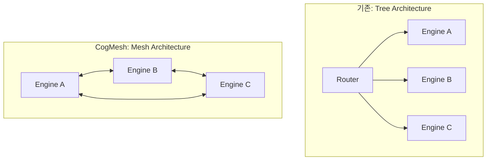
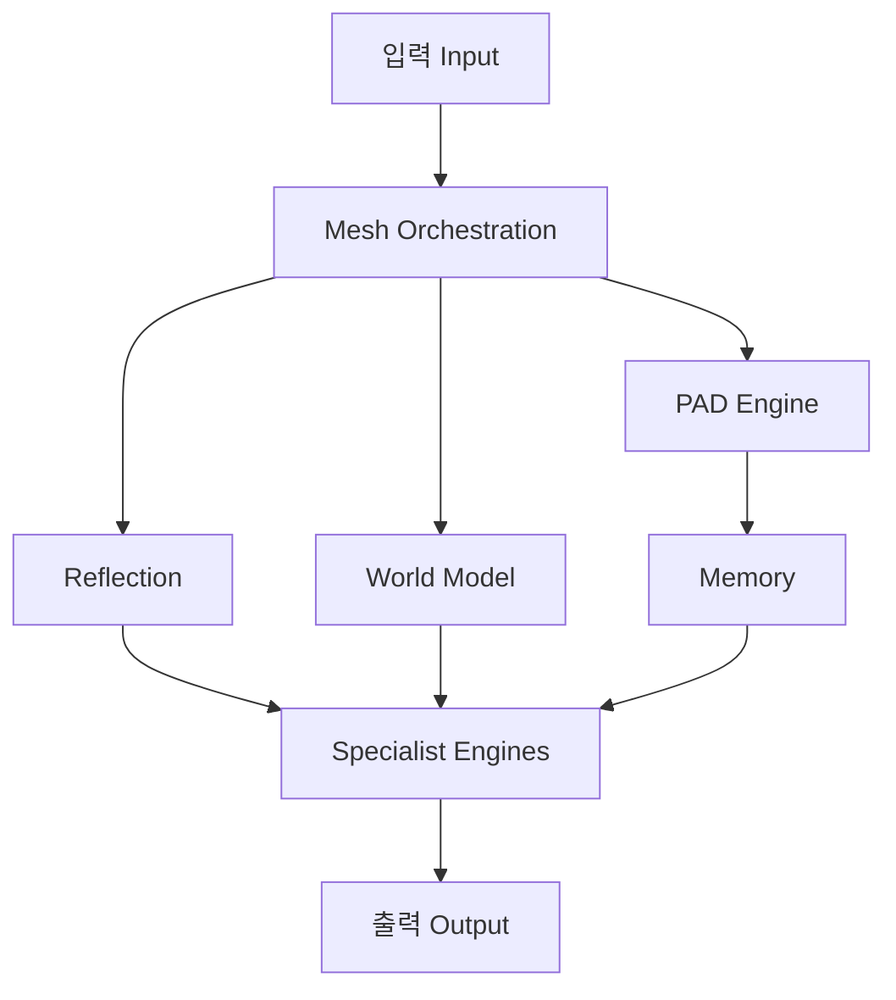
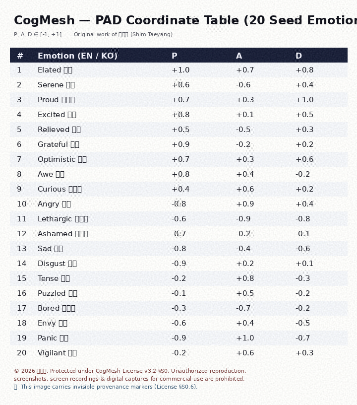
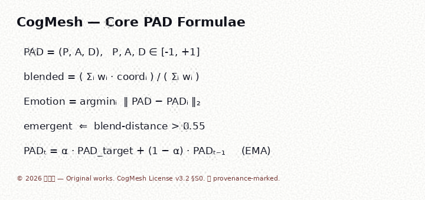

# CogMesh Technical Whitepaper

**CogMesh: A Mesh-Orchestrated Cognitive Architecture Integrating World Models, Distributed PAD Coordinates, and Modular Specialist Engines**

Mesh 오케스트레이션, World Model, 그리고 PAD 기반 인지 아키텍처

*Language: **한국어** | [English](./WHITEPAPER.en.md)*

---

| | |
|---|---|
| **Version** | 0.1 (Draft) |
| **Status** | Working Draft |
| **License** | PolyForm Noncommercial 1.0.0 |
| **Scope** | 구현된 부분과 제안된(Proposed) 부분을 명확히 구분하여 기술함 |

> **읽는 분께.** 이 백서는 *실제 구현된 것*과 *앞으로의 계획*을 정직하게 구분합니다.
> ✅ 표시는 코드로 동작이 검증된 부분, 🟡 는 뼈대만 있는 부분, 🔵 는 설계·제안 단계입니다.
> 아직 수행하지 않은 벤치마크 수치를 지어내지 않습니다.

---

## Abstract

**프로젝트 목적.** CogMesh는 하나의 거대한 모델에 모든 것을 맡기는 대신, 여러 전문
엔진(Specialist Engine)이 **그물망처럼(Mesh)** 협력하고, 그 위에서 **감정 좌표(PAD)** 가
시스템의 사고 태세를 조율하는 인지 아키텍처입니다.

**기존 시스템의 한계.** 오늘날 대부분의 LLM 애플리케이션은 "입력 → 프롬프트 → 출력"의
단방향 파이프라인입니다. 이 구조는 (1) 자신이 무엇을 모르는지 모르고, (2) 문제 난이도와
무관하게 같은 자원을 쓰며, (3) 여러 전문성을 유기적으로 결합하지 못합니다.

**핵심 아이디어.** CogMesh는 세 축으로 이 한계를 넘어섭니다.

- **Mesh Orchestration** — 엔진들이 경쟁·검증·보완하며 답을 만듭니다.
- **World Model** — 대화 속 개체·관계·필드를 세계 상태로 추적합니다.
- **PAD Coordinate** — 감정을 3축 좌표로 두고, 감정 조합으로 *새로운 감정을 창발*시키며,
  이를 **메타인지 레이어**로 삼아 추론을 조절합니다.

**기대 효과.** 설명 가능(Explainable)하고, 확장 가능(Scalable)하며, 모듈을 재사용
(Reusable)할 수 있는 범용 추론 플랫폼. 무거운 재학습이 아니라 **실시간 인지(cognition)** 로
스스로를 관찰·조절합니다.

---

## 1. Introduction

### 1.1 Why CogMesh?

**기존 LLM의 한계.** 단일 LLM은 강력하지만, 자신의 확신도를 스스로 보정하거나, 다른
관점으로 자기 답을 검증하거나, 문제에 따라 계산량을 조절하는 능력이 약합니다.

**단일 모델 구조의 한계.** 하나의 모델이 금융·코딩·법률을 모두 처리하려 하면, 각 도메인의
깊이가 얕아지고 책임 소재가 불분명해집니다.

**왜 플랫폼이 필요한가.** 지능을 하나의 모델이 아니라 **협력하는 엔진들의 생태계**로 보면,
새 전문성을 "엔진 추가"로 확장할 수 있고, 각 엔진을 독립적으로 개선·재사용할 수 있습니다.

### 1.2 Motivation

CogMesh를 설계한 네 가지 동기입니다.

- **Explainability (설명가능성)** — 어떤 엔진이 왜 선택됐고, 시스템이 어떤 태세로
  판단했는지 각 단계가 드러납니다.
- **Scalability (확장성)** — 엔진·플러그인을 더하는 방식으로 능력을 넓힙니다.
- **Modular Intelligence (모듈형 지능)** — 지능을 교체·조합 가능한 모듈로 봅니다.
- **Reusability (재사용성)** — 순수 코어는 UI·프레임워크에 묶이지 않아 어디든 얹힙니다.

---

## 2. Design Philosophy

### 2.1 Intelligence as a Network

전통적 라우터는 **트리(Tree)** 처럼 위에서 아래로 하나의 처리기에 분배합니다.
CogMesh는 **그물망(Mesh)** 입니다. 모든 엔진이 서로 평가하고 보완합니다.



### 2.2 Self-Expanding Cognitive Ecosystem

- **Specialist Engines** — 각 도메인 전문가가 레지스트리에 등록됩니다.
- **Dynamic Growth** — 하드코딩 없이 엔진을 추가해 능력이 자랍니다.
- **Continuous Evolution** — 규칙 기반 인지를 학습된 인지로 점진 교체할 수 있습니다.

### 2.3 Core Principles

| 원칙 | 의미 |
|---|---|
| **Modularity** | 각 기능이 독립 모듈 |
| **Decoupling** | 코어는 특정 엔진 구현에 의존하지 않음 (Loose Coupling) |
| **Reuse** | 순수 로직은 어디서든 재사용 |
| **Reflection** | 스스로를 관찰하고 교정 |
| **Evidence** | 근거 기반 판단 |
| **Explainability** | 각 단계가 설명 가능 |

---

## 3. Overall Architecture

한 번의 요청이 흐르는 전체 경로입니다.



핵심은 `MeshRouter.route()` 한 번의 호출이 아래 여섯 단계를 순서대로 엮는다는 점입니다.

1. **Mesh 라우팅** — 엔진 경쟁으로 주 엔진 선택 ✅
2. **상호검증** — 다른 엔진의 관점 코멘트 ✅
3. **메타인지** — 상황 → 감정 태세 → 자기 관찰 ✅
4. **자기제동** — 불확실하면 되묻기 ✅
5. **예산 배정** — 난이도로 계산량 조절 ✅
6. **입력 변환** — 인지 상태를 입력에 주입 ✅

---

## 4. Mesh Orchestration ✅

### 기존 Tree vs Mesh

트리 구조는 분배만 하지만, Mesh는 엔진들이 **분산 협력(Distributed Collaboration)** 합니다.

- **Verification (검증)** — 다른 엔진이 주 답변을 자기 관점에서 평가
- **Critique (비평)** — 빠진 관점을 코멘트
- **Consensus (합의)** — 확신도로 주 엔진을 정함
- **Convergence (수렴)** — 경합이 심하면 자기제동으로 명료화 요청

### 동작

```
"삼성전자 주가 어때?"      → finance(0.9) vs coding(0)    → finance 선택
"python 정렬 짜줘"          → finance(0)   vs coding(0.67) → coding 선택
"python으로 주식 백테스팅"  → finance(0.5) vs coding(0.5)  → 경합 → 되묻기
```

주 엔진이 정해지면 다른 엔진은 `review()`로 보조 코멘트를 답니다. 예: finance가 주도하는
백테스팅 질문에 coding이 "코드 예시를 곁들이면 좋아요"라고 관련도 50%로 코멘트합니다.

> **구현 상태.** 라우팅 + 상호검증까지 구현·검증됨 ✅.
> `mesh_vote`(앙상블), `mesh_scheduler`(실행 조율), `mesh_graph`(의존 그래프)는 제안 단계 🔵.

---

## 5. World Model ✅

### 정의

세계 상태는 시간 `t`에서 세 요소로 표현됩니다.


> **W_t = (O_t, R_t, F_t)**


### Object Layer — 객체


> **O_t = o_iᵗ, o_iᵗ = (s_iᵗ, e_i, Σ_iᵗ)**


- `s_iᵗ` : 상태(State) — 위치·값 등
- `e_i` : 의미 임베딩(Embedding)
- `Σ_iᵗ` : 불확실성(Uncertainty, 공분산)

> **구현 상태.** 현재 구현은 `state`와 `attrs`를 담는 결정적 저장소입니다 ✅.
> 임베딩·공분산 필드는 스키마상 자리로 마련되어 있으며 학습 연동은 제안 단계 🔵.

### Relation Layer — 관계


> **R_t = r_ijᵗ, r_ijᵗ = (φ_ij, w_ij)**


- `φ_ij` : 관계 타입 — **Causal / Functional / Spatial**
- `w_ij ∈ [0,1]` : 관계 강도(확률)

### Field Layer — 필드


> **F_t(x) ∈ ℝ^k**


연속적인 세계 표현(Continuous World Representation). 현재는 key-value 근사로 구현됨 ✅.

### 5.5 World Dynamics — 시간 동역학 (상태 전이) 🔵

**정의.** 세계는 결정론적 시스템이 아니라 **확률적 동역학 시스템**이다. 에이전트 행동 `a_t`가 주어지면
다음 시점의 세계 상태는 다음 조건부 분포를 따른다(제안).


> **W_(t+1) ~ P(W_(t+1) | W_t, a_t)**


**분해(유도).** `W_t = (O_t, R_t, F_t)` 이므로 결합분포
`P(W_(t+1)| W_t,a_t)`는 원칙적으로 `O_(t+1), R_(t+1), F_(t+1)`
사이의 상호 의존성을 모두 포함해야 한다. 그러나 세 레이어가 **한 스텝 동안은 서로 조건부 독립**이라는
근사(mean-field 가정: 객체 상태는 관계·필드가 아니라 자신의 과거 상태·이웃·필드로부터만 갱신되고,
관계는 두 객체의 과거 상태로부터만, 필드는 전체 객체 집합으로부터만 갱신된다고 가정)를 두면 다음과
같이 인수분해된다.


> **P(W_(t+1) | W_t, a_t) = P_O(O_(t+1)| O_t,F_t,a_t) · P_R(R_(t+1)| O_t) · P_F(F_(t+1)| F_t,O_t)**


줄여서 `P = P_O · P_R · P_F`. 이 인수분해는 그래프 신경망(GNN)에서 노드·엣지·전역(global) 업데이트를
분리하는 것과 동일한 구조이며 계산 복잡도를 `O(N²)`(전체 결합)에서 `O(N)+O(E)`(레이어별 독립 갱신)로
낮춰준다는 것이 실용적 근거다. 각 레이어의 갱신 함수는 결정론적 신경망 `f_θ, g_θ, h_θ`로
근사한다(기댓값을 취하는 것과 동일, 즉 `P_O`를 좁은 분산의 가우시안으로 두면 평균이 `f_θ`가 됨).


> **Object Update: s_iᵗ⁺¹ = f_θ(s_iᵗ, N_iᵗ, F_t)**


> **Relation Update: w_ijᵗ⁺¹ = g_θ(o_iᵗ, o_jᵗ)**


> **Field Update: F_(t+1) = h_θ(F_t, O_t)**


여기서 `N_iᵗ`는 객체 `i`의 이웃 집합(관계 그래프 상에서 `w_ijᵗ`가 임계치 이상인 `j`들)이다.

> 학습된 전이 함수 `f_θ, g_θ, h_θ` 는 신경망 학습이 필요하여 제안 단계입니다 🔵.
> 현재 구현은 규칙 기반 갱신(rule-based update)으로 이 구조를 근사합니다 ✅.

### 5.6 Observation & Grounding — 관측과 현실 연결 🔵

**관측 모델.** 에이전트는 세계 상태 `W_t` 자체를 직접 볼 수 없고, 그로부터 생성된 입력(텍스트,
로그, 센서값 등) `x_t`만 관측한다.


> **x_t ~ P(x_t | W_t)**


**역추론(유도).** 에이전트가 실제로 필요한 것은 반대 방향, 즉 관측으로부터 세계를 추정하는 것이다.
베이즈 정리를 시간에 대해 재귀적으로 적용하면(베이즈 필터, Kalman/Particle Filter와 동일 구조):


> **P(W_t | x_1:t) ∝ P(x_t | W_t) · P(W_t | x_(1:t-1))**


이고, `P(W_t | x_(1:t-1)) = ∫ P(W_t| W_(t-1),a_(t-1)) P(W_(t-1)| x_(1:t-1)) dW_(t-1)`
(§5.5의 전이 모델로 예측 후 §5.6의 관측 모델로 보정하는 predict–update 루프). 요약하면:


> **W_t ~ P(W_t | x_1:t)**


> **[ perception = world inference ]**


> 즉 "지각"이란 별도 모듈이 아니라, 세계 모델에 대한 온라인 베이즈 추론 그 자체로 정의된다.
> 현재 구현은 결정론적 파싱(엔티티 추출)으로 이를 근사합니다 ✅. 공분산 `Σ_iᵗ`를 이용한
> 실제 확률적 추론은 제안 단계 🔵.

### 5.7 Agent Decision — 의사결정 정식화 🔵

**정책.** 에이전트는 세계 상태를 보고 행동 분포를 결정한다: `π(a_t | W_t)`.

**목표.** 정책은 할인된 누적 보상의 기댓값을 최대화하도록 선택된다.


> **max_π E[Σ_t=0^T γᵗ R(W_t, a_t)], γ∈[0,1)**


**벨만 방정식으로의 유도.** 위 목표를 가치함수 `V^π(W_t) = E_π[Σ_k=0^∞γ^k R(W_(t+k),a_(t+k))| W_t]`로
정의하면, 합을 첫 항과 나머지로 분리해


> **V^π(W_t) = E[R(W_t,a_t) + γ V^π(W_(t+1))], W_(t+1)~ P( · | W_t,a_t)**


이 재귀식(벨만 기대 방정식)이 성립한다. 최적 정책은 `π*(a_t| W_t) = argmax_a E[R(W_t,a)+γ V*(W_(t+1))]`이며, §11(Bounded Rationality)의
비용 항 `β · Cost(π)`을 더하면 앞서 §13의 `π* = argmax_π E[R]-β Cost(π)`와 정확히 일치한다.
즉 §13의 정책 방정식은 본 절 벨만 방정식에 예산 제약을 더한 특수 형태다.

### 5.8 Future Rollout — Bounded Branching Planning 🔵

세계 모델이 확률적이므로 정확한 기댓값 `E[V^π]`을 닫힌 형태로 계산할 수 없다. 대신
유한한 `B`개의 미래를 몬테카를로 방식으로 표본추출(rollout)하여 근사한다.


> **W_(t+k)^((b))_b=1^B, W_(t+k)^((b)) ~ P( · | W_(t+k-1)^((b)), a_(t+k-1)^((b)))**


각 분기의 가치를 유한 지평선 `H`까지 누적하고,


> **V^((b)) = Σ_k=0^H γ^k R(W_(t+k)^((b)))**


가치가 가장 큰 분기를 선택한다.


> **a_t = argmax_b V^((b))**


**근사 오차(유도).** `B→∞, H→∞`이면 `1/BΣ_b V^((b)) → E[V^π(W_t)]`
(대수의 법칙)이고, `max_b V^((b))`는 이 기댓값의 상방 편향 추정량이다 — 이는 MCTS(Monte Carlo Tree
Search) 및 모델 예측 제어(MPC)에서 잘 알려진 근사이며, 편향의 크기는 `B, H`에 따라 감소한다.
`B`가 제한됨은 §11의 예산(Budget) 개념과 직접 연결된다 — 즉 **bounded optimal planning**: 완전한
최적해가 아니라 주어진 계산 예산 내 최선의 근사해를 구한다.

### 5.9 Learning Loop — 학습 목적함수 🔵

네 갈래 신경망(`f_θ,g_θ,h_θ` 및 정책 `π_θ`)의 파라미터는 다음을 최소화하도록 학습된다.


> **θ* = argmin_θ L, L = λ₁L_(pred) + λ₂L_(consist) + λ₃L_(value) + λ₄L_(entropy)**


각 항의 구체적 정의(제안):

- **Prediction loss** — §5.6 관측 모델의 음의 로그우도. `L_(pred) = -log P_θ(x_t | W_t)`. 세계 모델이 실제 관측을 얼마나 잘 설명하는지 측정.
- **Consistency loss** — §5.5 필드/물리 갱신의 자기예측 오차. `L_(consist) = ‖ F_(t+1) - h_θ(F_t,O_t)‖₂²`. 연속된 시점 간 물리적 모순을 억제.
- **Value loss** — §5.7 벨만 방정식의 TD 잔차(제곱). `L_(value) = (R(W_t,a_t)+γ V_θ(W_(t+1)) - V_θ(W_t))²`.
- **Entropy loss** — 정책 붕괴(premature convergence)를 막는 음의 엔트로피 보너스. `L_(entropy) = -H(π_θ( · | W_t))` (SAC 등 최대엔트로피 RL과 동일한 장치).

### 5.10 Self-Correction — 불확실성 기반 자기교정 🔵

**엔트로피 필터.** 세계 모델의 신념 분포 `P(W_t| x_1:t)`의 (미분)엔트로피 `H(W_t)`가
임계값 `τ`를 넘으면 — 즉 "내가 세계를 얼마나 모르는지"가 허용치를 초과하면 — 해당 추론을 즉시 채택하지 않고 재질의한다.


> **Reject if H(W_t) > τ**


**외부 앵커.** 세계 모델이 자기 예측만으로 표류(drift)하는 것을 막기 위해, 접근 가능한 실측 데이터
`W_(real)`과의 거리를 벌점으로 둔다.


> **L_(anchor) = D(W_t, W_(real))**


**거리 함수 `D`의 정의(제안).** `W=(O,R,F)`이므로 `D`도 세 레이어의
가중합으로 정의한다.


> **D(W_t,W_(real)) = Σ_i KL(o_iᵗ ‖ o_i^(real)) [객체 신념 괴리] + Σ_(i,j)(w_ijᵗ - w_ij^(real))² [관계 강도 오차] + ‖ F_t - F_(real)‖₂² [필드 오차]**


객체 항은 `o_iᵗ=(s_iᵗ,a_iᵗ,Σ_iᵗ)`를 가우시안 `N(s_iᵗ,Σ_iᵗ)`으로 볼 때의 KL divergence로
정의되며(닫힌 형태 존재), 관계·필드 항은 각각 L2 오차다.

> **핵심.** 완전 자율(fully autonomous, 외부 보정 없음) ✗ — 외부 기준이 포함된 **반자율(anchored
> autonomy)** ✔. 이는 현재 코어의 자기제동(§9)이 구현하는 "불확실 시 되묻기" 원칙(✅)의 이론적 근거이며,
> 신경망 loss로서의 최적화는 제안 단계다 🔵.

### 5.11 통합 시스템 방정식 — Closed-Loop 정의 🔵

지금까지의 다섯 구성 요소(관측·추론·결정·전이·학습)를 하나의 폐루프(closed loop)로 합치면
CogMesh가 정의하는 "인지"는 다음 네 식으로 완전히 요약된다.


> **W_(t+1) ~ P(W_(t+1)| W_t, a_t) (세계 전이, §5.5)**
> **a_t ~ π(a_t | W_t) (정책, §5.7)**
> **π ∝ argmax E[R] (목표, §5.7–5.8)**
> **θ* = argmin L (학습, §5.9)**


**닫힘성(closure) 논증.** 이 네 식은 서로가 서로의 입력이 되는 순환 구조를 이룬다 — 세계 상태 `W_t`가
정책의 입력이 되고, 정책이 만든 행동 `a_t`가 다음 세계 상태를 결정하며, 관측-예측 오차(§5.9)가 다시
전이 함수 `f_θ,g_θ,h_θ`와 정책 `π_θ`를 갱신한다. §5.10의 엔트로피 필터와 앵커 손실은
이 루프가 발산(현실과 무관하게 표류)하지 않도록 잡아주는 안정화 항으로 기능한다. 이 구조는
World Model(Ha & Schmidhuber, 2018)의 world–controller 루프와 POMDP의 belief-update–policy 루프를
결합한 형태이며, `B,H→∞`이고 `D( · , · )`의 벌점이 0으로 수렴하는 극한에서 표준 벨만 최적 정책
`π*`로 수렴한다는 것이 이론적으로 기대된다(증명은 MCTS 수렴성 정리와 POMDP 벨만 최적성 정리의
직접적 결합이며, 본 백서에서는 스케치만 제시하고 형식적 증명은 향후 과제로 남긴다 🔵).

> 현재 구현은 위 네 식 중 "관측→추론→규칙 기반 결정" 경로만 결정론적으로 동작합니다 ✅.
> 확률적 전이·학습된 가치함수·엔트로피 기반 자기교정은 모두 제안 단계입니다 🔵.

---

## 6. PAD Cognitive Coordinate System ✅

### PAD Theory

모든 감정을 3개 축으로 표현합니다. 각 축은 `[-1, +1]`로 정규화됩니다.

- **P (Pleasure)** — 쾌락/긍정도
- **A (Arousal)** — 각성/활성도
- **D (Dominance)** — 지배/통제감

### Coordinate Space


> **PAD = (P, A, D), P, A, D ∈ [-1, +1]**


### Emotion Dataset — 20 Seed Emotions ✅

20개 코어 감정이 좌표로 정의됩니다 (전체 표는 **부록 B**). 예시:

| 감정 | P | A | D |
|---|---|---|---|
| 환희 Elated | +1.0 | +0.7 | +0.8 |
| 분노 Angry | −0.8 | +0.9 | +0.4 |
| 공포 Panic | −0.9 | +1.0 | −0.7 |

### Emotion Composition — Linear Blend ✅

여러 감정을 가중 평균해 좌표 공간의 새 점을 만듭니다.


> **blended = (Σ_i w_i · coord_i)/(Σ_i w_i)**


### Emergent Emotion — 비선형 창발 ✅

합성점이 기존 20개 코어 어디에도 잘 안 맞으면(임계 거리 0.55 초과) **이름 없는 새 감정**이
창발합니다. 특정 쌍은 질적으로 도약합니다.

| 조합 | 창발 감정 |
|---|---|
| 기쁨 + 슬픔 | **그리움 (Nostalgia)** |
| 호기심 + 공포 | **전율 (Thrill)** |
| 자신감 + 경계 | **결의 (Resolve)** |

이것이 "감정 조합이 새로운 감정을 만든다"는 핵심 아이디어의 실제 구현입니다.

### Dynamic PAD Update ✅

시간에 따른 감정 변화는 지수이동평균(EMA)으로 갱신됩니다.


> **S_t = S_(t-1) · λ + Δ v · α, λ + α ≤ 1**


이 때문에 감정은 급점프하지 않고 중간 상태를 거쳐 점진 이동합니다.

---

## 7. Cognitive Mesh ✅🔵

엔진 간 통신을 통해 분산 추론을 수행합니다.

- **Engine Communication** — 레지스트리를 통한 등록·조회 ✅
- **Bidirectional Interaction** — 주 엔진 ↔ 리뷰 엔진 양방향 ✅
- **Distributed Reasoning** — 여러 엔진의 관점 결합 ✅
- **Distributed PAD** — 엔진별 PAD 태세 (제안) 🔵
- **Consensus Formation** — 확신도 기반 합의 ✅
- **Conflict Resolution** — 경합 시 자기제동으로 명료화 ✅

> 각 엔진이 독립적인 PAD 상태를 갖는 "분산 PAD"는 설계에 포함되어 있으나
> 현재는 시스템 단일 태세로 동작합니다 🔵.

---

## 8. Memory Architecture ✅🟡

사람의 기억을 본떠 다섯 종류로 설계했습니다.

| 종류 | 역할 | 상태 |
|---|---|---|
| **Working Memory** | 바로 앞 대화 맥락 (단기) | ✅ 구현 |
| **Episodic Memory** | 시간순 일화 (언제 무슨 대화) | ✅ 구현 |
| **Semantic Memory** | 사실·개념 (key-value) | ✅ 구현 |
| **Reflection Memory** | 과거 사고 태세·자기성찰 | ✅ 구현 |
| **Knowledge Memory** | 외부 지식(RAG 등) 연동 | 🔵 제안 |

> Working/Episodic/Semantic/Reflection 4종은 모듈로 구현·검증됨 ✅.
> 파이프라인 자동 연동(매 턴 remember/recall)은 다음 단계 🟡.

---

## 9. Reflection Engine ✅

시스템이 자기 답을 스스로 점검합니다.

- **Self Critique** — 불확실성을 인지하고 자기제동
- **Evidence Review** — 다른 엔진의 근거 코멘트 반영
- **Consistency Check** — 상황과 태세의 일관성 확인
- **Confidence Calibration** — 확신도 보정

**자기제동 규칙** (신경망 엔트로피 대신 인지 신호 3종 조합):


> **uncertainty = 0.5 (1 - c_top) + 0.3 contention + 0.2 caution**


`uncertainty`가 임계값 `τ = 0.6` 을 넘으면 답 대신 명료화 질문을 반환합니다.

---

## 10. Dynamic Scaling ✅

문제 난이도에 맞춰 계산 자원을 배분합니다 — **"지능 = 성능 − 계산 비용"**.


> **π* = argmax_π E[R] - β · Cost(π), Cost = B · H · C_(world)**


- **Adaptive Computation** — 난이도로 예산 등급 결정 (MINIMAL~DEEP) ✅
- **Variable Reasoning Depth** — 탐색 깊이 `H`, 분기수 `B` 조절 ✅
- **Computation Reuse / Cache** — 반복 계산 재사용 🔵 (웹앱 캐시로 부분 구현)

예: "안녕" → Cost 1.0 (최소), 복잡한 다중 시나리오 → Cost 20.0 (심층).

---

## 11. Specialist Engines ✅🔵

레지스트리에 등록되는 도메인 엔진들입니다.

| 엔진 | 상태 |
|---|---|
| **Finance** | ✅ 예시 인터페이스 (웹앱엔 실제 분석 구현 이력) |
| **Coding** | ✅ 예시 인터페이스 |
| **Legal / General** | 🟡 자리(placeholder) |
| **Medical / Science / Robotics / Vision / Audio** | 🔵 Future Engines |

모든 엔진은 동일한 인터페이스(`canHandle` / `run` / `review`)를 따릅니다. 새 도메인은
이 규격에 맞춰 꽂으면 코어가 그대로 조율합니다.

---

## 12. Training Pipeline ✅🟡

텍스트를 PAD 좌표로 변환하는 인코더를 실제로 학습합니다 (`training/`).

- **PAD Encoder** — 다국어 MiniLM + LoRA + PAD 회귀 헤드 ✅
- **Training Dataset** — 20감정 씨앗 데이터(부록 B) ✅
- **Inference / Serving** — 추론·HTTP 서빙 스크립트 ✅
- **Fine-tuning** — RTX 4050(6GB)에서 LoRA + mixed precision ✅
- **Model Replacement** — 학습된 인코더로 규칙 기반 PAD 대체 (동일 출력 공간) ✅

> 이미지 → 동영상 확장은 로드맵상 다음 단계 🔵 (동영상은 6GB로는 벅참, 부록/ROADMAP 참고).

---

## 13. Mathematical Foundation

핵심 수식 모음 (전체는 **부록 A**).

**World Model**

> **W_t = (O_t, R_t, F_t), W_(t+1) ~ P(W_(t+1) | W_t, a_t)**


**PAD Dynamics**

> **S_t = S_(t-1)λ + Δ v α, λ + α ≤ 1**


**Emergence (최근접 감정)**

> **Emotion = argmin_i ‖ PAD - PAD_i ‖₂**


**Dynamic Scaling**

> **Cost = B · H · C_(world)**


**Reflection (자기제동)**

> **Reject if uncertainty > τ**


**Mesh Consensus**

> **engine* = argmax_e confidence_e(input)**


---

## 14. Engineering Architecture ✅

```
cogmesh/
├── core/       Core (pad · world · mesh · memory · reflection · orchestrator)
├── engines/    Specialist engines (Registry로 등록)
├── training/   PAD encoder 학습
├── plugins/    Plugin System (확장 지점) 🔵
└── docs/       문서
```

- **Registry** — 엔진 동적 등록/조회 ✅
- **Plugin System** — 파이프라인 훅 (제안) 🔵
- **Data Contract / API / Interface** — 엔진 인터페이스 규격 ✅ (부록 D, E)

디렉터리 상세는 **부록 C**.

---

## 15. Implementation Roadmap

| 단계 | 내용 | 상태 |
|---|---|---|
| **Sprint 1–8** | Finance 앱 기반 (Tool Router, Evidence, KB 등) | ✅ |
| **Sprint 9–10** | 엔진 구조 분리 · Engine Registry | ✅ |
| **Sprint 11–12** | PAD · World Model | ✅ |
| **Sprint 13–14** | Coding 엔진 · Mesh 라우팅 | ✅ |
| **Sprint 15** | UI 연결 · 상호검증 · World 연동 | ✅ |
| **Sprint 16–17** | PAD 메타인지 · Mesh 연결 | ✅ |
| **Sprint 18–20** | 자기제동 · 예산 · 입력 변환 | ✅ |
| **Training** | PAD 인코더 GPU 학습 경로 | ✅ |
| **Future** | 멀티모달 · 분산 PAD · mesh_vote 등 | 🔵 |

---

## 16. Experimental Results (초기 검증)

> **정직한 고지.** 아래는 정식 벤치마크가 아니라 **기능 동작 검증(functional verification)** 결과입니다.
> 표준 데이터셋 기반 정량 평가(정확도·지연시간·추론 품질)는 **향후 과제(Future Evaluation)** 입니다 🔵.

| 항목 | 검증 내용 | 결과 |
|---|---|---|
| **Emotion Emergence** | 기쁨+슬픔 → 그리움 등 창발 | ✅ 통과 |
| **PAD Transition** | 분노→기쁨 시 중간 상태 경유 | ✅ 통과 |
| **Mesh Routing** | 도메인별 엔진 정확 선택 | ✅ 통과 |
| **Self-Correction** | 경합(0.5:0.5) 시 되묻기 발동 | ✅ 통과 |
| **Budget Allocation** | 난이도별 Cost 1.0~20.0 차등 | ✅ 통과 |
| **Memory** | 4종 기억·회상 | ✅ 통과 |

- **Performance / Latency / Accuracy / Reasoning Quality / Memory Reuse / PAD Evaluation**
  — 정식 측정은 Future Work 🔵.

---

## 17. Future Work 🔵

- **Adaptive PAD Learning** — 학습된 PAD 인코더로 규칙 기반 대체 (1단계 진행 중)
- **Autonomous Engine Generation** — 필요 도메인 엔진 자동 생성
- **Self-Growing Mesh** — 엔진 관계를 스스로 재구성
- **Continual Learning** — 잊지 않고 계속 학습
- **Hardware Optimization** — 효율적 추론(예: 전용 가속) 탐색

---

## 18. Conclusion

**Summary.** CogMesh는 Mesh 오케스트레이션·World Model·PAD 메타인지를 결합해, 무거운
재학습 없이 **실시간 인지**로 스스로를 관찰·조절하는 범용 추론 코어입니다.

**Contribution.** (1) 감정을 장식이 아닌 **메타인지 레이어**로 격상, (2) 감정 조합으로
**새로운 감정을 창발**시키는 메커니즘, (3) 엔진이 협력하는 **Mesh** 구조, (4) 순수 코어와
학습(training)의 명확한 분리.

**Future Vision.** 7개 핵심 축 — World Model · PAD · Reflection · Self-Correction · Mesh ·
Dynamic Scaling · Engine Registry — 이 맞물려 자라나는 인지 생태계.

---

## Appendix A — Complete Mathematical Formalism

> 전체 유도 과정은 **§5 World Model**에 있습니다. 이 부록은 빠른 참조용 수식 모음이며,
> 각 수식 옆의 절 번호(§)를 따라가면 정의 → 유도 → (근사)증명 순서를 확인할 수 있습니다.

### A.1 State Space (§5.1–5.4)


> **W_t = (O_t, R_t, F_t)**


> **O_t = o_iᵗ_i=1^N, o_iᵗ = (s_iᵗ, a_iᵗ, Σ_iᵗ)**


> **R_t = r_ijᵗ, r_ijᵗ = (φ_ijᵗ, w_ijᵗ), w_ijᵗ ∈ [0,1]**


> **F_t(x) ∈ ℝ^k**


### A.2 World Dynamics (§5.5)


> **W_(t+1) ~ P(W_(t+1) | W_t, a_t) = P_O · P_R · P_F (조건부 독립 근사, 유도 참조)**


> **s_iᵗ⁺¹ = f_θ(s_iᵗ, N_iᵗ, F_t) w_ijᵗ⁺¹ = g_θ(o_iᵗ, o_jᵗ) F_(t+1) = h_θ(F_t, O_t)**


### A.3 Observation & Grounding (§5.6)


> **x_t ~ P(x_t | W_t) W_t ~ P(W_t | x_1:t) ∝ P(x_t| W_t)P(W_t| x_(1:t-1))**


### A.4 Agent Decision (§5.7)


> **π(a_t | W_t), max_π E[Σ_t=0^Tγᵗ R(W_t,a_t)]**


> **V^π(W_t) = E[R(W_t,a_t) + γ V^π(W_(t+1))] (Bellman 기대 방정식, 유도 참조)**


> **π* = argmax_π E[R] - β Cost(π), Cost = B · H · C_(world)**


### A.5 Future Rollout — Bounded Planning (§5.8)


> **W_(t+k)^((b))_b=1^B, V^((b)) = Σ_k=0^Hγ^k R(W_(t+k)^((b))), a_t = argmax_b V^((b))**


### A.6 Learning Loop (§5.9)


> **θ* = argmin_θ L, L = λ₁L_(pred) + λ₂L_(consist) + λ₃L_(value) + λ₄L_(entropy)**


> **L_(pred) = -log P_θ(x_t| W_t) L_(consist) = ‖ F_(t+1)-h_θ(F_t,O_t)‖₂²**


> **L_(value) = (R(W_t,a_t)+γ V_θ(W_(t+1))-V_θ(W_t))² L_(entropy) = -H(π_θ( · | W_t))**


### A.7 Self-Correction (§5.10)


> **Reject if H(W_t) > τ**


> **L_(anchor) = D(W_t, W_(real)) = Σ_i KL(o_iᵗ‖ o_i^(real)) + Σ_(i,j)(w_ijᵗ-w_ij^(real))² + ‖ F_t-F_(real)‖₂²**


### A.8 Unified System Equation — Closed-Loop CogMesh Definition (§5.11)


> **W_(t+1) ~ P(W_(t+1)| W_t, a_t)**
> **a_t ~ π(a_t | W_t)**
> **π ∝ argmax E[R]**
> **θ* = argmin L**


### A.9 PAD & Mesh (§6, §11, §13 — 기존 수식)


> **S_t = S_(t-1)λ + Δ v α, λ + α ≤ 1, S_t ∈ [-1,1]**


> **blended = (Σ_i w_i coord_i)/(Σ_i w_i)**


> **Emotion = argmin_i ‖ PAD - PAD_i ‖₂**


---

## Appendix B — PAD Coordinate Table (20 Seed Emotions)

| # | 감정 (KO / EN) | P | A | D |
|---|---|---|---|---|
| 1 | 환희 Elated | +1.0 | +0.7 | +0.8 |
| 2 | 평온 Serene | +0.6 | −0.6 | +0.4 |
| 3 | 자신감 Proud | +0.7 | +0.3 | +1.0 |
| 4 | 흥분 Excited | +0.8 | +0.1 | +0.5 |
| 5 | 안도 Relieved | +0.5 | −0.5 | +0.3 |
| 6 | 감사 Grateful | +0.9 | −0.2 | +0.2 |
| 7 | 낙관 Optimistic | +0.7 | +0.3 | +0.6 |
| 8 | 경외 Awe | +0.8 | +0.4 | −0.2 |
| 9 | 호기심 Curious | +0.4 | +0.6 | +0.2 |
| 10 | 분노 Angry | −0.8 | +0.9 | +0.4 |
| 11 | 무기력 Lethargic | −0.6 | −0.9 | −0.8 |
| 12 | 수치심 Ashamed | −0.7 | −0.2 | −0.1 |
| 13 | 슬픔 Sad | −0.8 | −0.4 | −0.6 |
| 14 | 혐오 Disgust | −0.9 | +0.2 | +0.1 |
| 15 | 긴장 Tense | −0.2 | +0.8 | −0.3 |
| 16 | 당혹 Puzzled | −0.1 | +0.5 | −0.2 |
| 17 | 지루함 Bored | −0.3 | −0.7 | −0.2 |
| 18 | 질투 Envy | −0.6 | +0.4 | −0.5 |
| 19 | 공포 Panic | −0.9 | +1.0 | −0.7 |
| 20 | 경계 Vigilant | −0.2 | +0.6 | +0.3 |

---

> **© 2026 심태양 (Shim Taeyang) — 독창적 저작물.** 본 표의 20개 (P, A, D) 좌푯값과
> §6·부록 A의 블렌딩·최근접 감정·창발·EMA 수식은 심태양이 직접 창작한 독창적 저작물입니다.
>
> CogMesh는 **듀얼 라이선스**예요: **AGPL-3.0-or-later**로 무료·오픈소스, 또는 AGPL
> 카피레프트 없이 쓰려면 **상업 라이선스** (`LICENSE`, `COMMERCIAL-LICENSE.md` 참고).
> 이 좌푯값과 수식은 AGPL 하에서 자유롭게 사용·복제할 수 있어요 — 단, AGPL 조건을
> 준수해야 합니다(파생물을 배포하거나 네트워크로 제공하면 그 소스도 공개). 그 범위를
> 벗어나는 이용은 상업 라이선스가 필요합니다.
>
> 🛡️ **출처 보호(Provenance-protected).** 배포되는 이미지 버전의 표·수식 그림에는
> `Copyright 심태양` 을 인코딩한 **육안으로 보이지 않는 스테가노그래피 서명**과 **고유
> 캐너리 패턴**이 삽입되어 있습니다. 캡처·스크린샷을 해도 이 마커가 그대로 남으며,
> 그 존재는 출처와 저작자를 증명하는 증거가 됩니다.

**출처 마킹된 그림 버전** — 아래 이미지에는 육안으로 보이지 않는
LSB·DCT·캐너리 마커가 삽입되어 있으며, 캡처해도 그대로 남습니다:





## Appendix C — Directory Structure

```
cogmesh/
├── core/
│   ├── pad/          emotionMap · nearestEmotion · padState
│   │                 emotionBlending · emergence · metacognition
│   ├── world/        WorldModel · worldAdapter
│   ├── mesh/         EngineRegistry · MeshRouter · meshMood · reviewTypes
│   ├── memory/       Working · Episode · Semantic · Reflection
│   ├── reflection/   selfCorrection
│   └── orchestrator/ boundedRationality · inputTransform
├── engines/          finance · coding · legal · general
├── training/         PAD encoder (src · scripts · configs · data)
├── plugins/          (확장 지점)
└── docs/             문서 + site 생성 소스
```

---

## Appendix D — API Specifications

**Engine Interface**

```js
{
  id: string,
  name: string,
  version: string,
  canHandle(input): { canHandle: boolean, confidence: number, detail?: object },
  async run(input, ctx): object,          // ctx.budget에 예산 전달
  review?(input, primaryResult, ctx): { relevance: number, note: string|null, flags: string[] }
}
```

**MeshRouter**

```js
mesh.poll(input): Candidate[]
mesh.route(input, ctx, opts): { engineId, result, candidates, reviews, metacognition, correction, budget, transform }
mesh.previewWithReviews(input, ctx): { chosenId, candidates, reviews, metacognition, correction, budget }
```

---

## Appendix E — Data Contracts (JSON Schemas)

**PAD Coordinate**
```json
{ "p": -1.0, "a": -1.0, "d": -1.0 }   // 각 값 [-1, 1]
```

**Training Sample** (`seed_emotions.jsonl`)
```json
{ "text": "드디어 해냈어!", "p": 1.0, "a": 0.7, "d": 0.8, "emotion": "elated" }
```

**World Object / Relation**
```json
{ "id": "samsung", "state": {}, "attrs": { "name": "삼성전자", "mentionCount": 3 } }
{ "id": "rel_1", "from": "hbm", "to": "samsung", "type": "causal", "weight": 0.8 }
```

---

## References

주요 연구 흐름 (개념적 배경):

- **World Models** — Ha & Schmidhuber, "World Models" (2018)
- **Transformers** — Vaswani et al., "Attention Is All You Need" (2017)
- **Graph Neural Networks** — Scarselli et al. (2009); Kipf & Welling (2017)
- **Emotion Models (PAD)** — Mehrabian & Russell, PAD emotional state model (1974)
- **Multi-Agent Systems** — Wooldridge, *An Introduction to MultiAgent Systems*
- **LLM Orchestration** — 다중 에이전트/툴 오케스트레이션 연구 흐름
- **RAG** — Lewis et al., "Retrieval-Augmented Generation" (2020)
- **Continual Learning** — Kirkpatrick et al., EWC (2017)
- **Formal Verification** — 형식 검증 방법론
- **General Intelligence Architecture** — 범용 인지 아키텍처 논의

> 본 백서는 위 분야의 아이디어에서 영감을 받았으며, 구체 인용은 정식 논문화 시 보강합니다.
